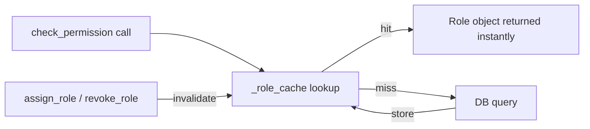

# PRD — Community 563: RBAC — Cached Role Lookup Cache

## Master Goal Mapping
**ALDECI Pillar:** RBAC engine — maintains an in-memory role cache that avoids repeated DB lookups; must be explicitly invalidated when a user's role assignment changes.

## Architecture Diagram


## Code Proof
**File:** `suite-core/core/rbac.py:L309`  
**Module:** `rbac.RBACManager._role_cache`

```python
# Inside RBACManager.__init__:
self._role_cache: Dict[str, Role] = {}
# Docstring on cache field:
"""Cached role lookup. Must clear when role changes."""
```

## Inter-Dependencies
- `RBACManager.check_permission()` — reads from cache
- `RBACManager.assign_role()` — must clear cache after write
- `RBACManager.revoke_role()` — must clear cache after write
- C557–C562 built-in roles — stored in and read from this cache

## Data Flow
Permission check → cache lookup → cache hit returns Role directly; miss queries DB and populates cache. Role mutations must call cache clear.

## Referenced Docs
- ALDECI Rearchitecture v2 §RBAC Performance
- Cache invalidation patterns

## Acceptance Criteria
- [ ] Cache hit on second identical lookup (no DB query)
- [ ] Cache cleared after `assign_role()` call
- [ ] Cache cleared after `revoke_role()` call
- [ ] Cache thread-safe under concurrent access
- [ ] Stale entry never served after role change

## Effort Estimate
S — 1 day (implemented; add cache-invalidation integration test)

## Status
DONE — cache initialized at L309; invalidation logic in assign_role/revoke_role
