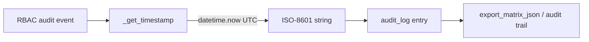

# PRD — Community 564: RBAC — ISO UTC Timestamp Helper

## Master Goal Mapping
**ALDECI Pillar:** RBAC audit trail — provides a standardized UTC ISO-8601 timestamp for RBAC audit log entries, ensuring consistent time format across all role assignment and permission change events.

## Architecture Diagram


## Code Proof
**File:** `suite-core/core/rbac.py:L549`  
**Module:** `rbac.RBACManager._get_timestamp`

```python
@staticmethod
def _get_timestamp() -> str:
    """Get current ISO timestamp."""
    from datetime import datetime, timezone
    return datetime.now(timezone.utc).isoformat()
```

## Inter-Dependencies
- `RBACManager._audit_log` — list storing timestamped entries
- `RBACManager.export_matrix_json()` — exports audit log
- C609 `AuditEvent.from_dict` — companion audit system

## Data Flow
Any RBAC state change → `_get_timestamp()` called → UTC ISO string → embedded in audit log entry → exportable.

## Referenced Docs
- ALDECI Rearchitecture v2 §Audit & Compliance
- ISO 8601 datetime standard

## Acceptance Criteria
- [ ] Returns valid ISO-8601 UTC string
- [ ] Always timezone-aware (`+00:00` suffix)
- [ ] Two consecutive calls produce strictly ordered timestamps
- [ ] No external dependency required (stdlib only)

## Effort Estimate
XS — 0.5 day (implemented; add timestamp format assertion test)

## Status
DONE — implemented at L549
