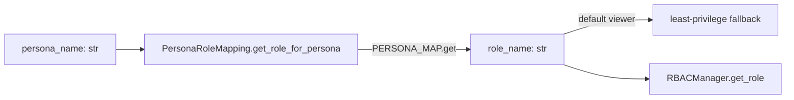

# PRD — Community 565: RBAC — Persona-to-Role Lookup

## Master Goal Mapping
**ALDECI Pillar:** RBAC persona model — maps any of ALDECI's 30 named personas to their assigned RBAC role, defaulting to `viewer` for unknown personas to maintain least-privilege.

## Architecture Diagram


## Code Proof
**File:** `suite-core/core/rbac.py:L604`  
**Module:** `rbac.PersonaRoleMapping.get_role_for_persona`

```python
@classmethod
def get_role_for_persona(cls, persona_name: str) -> str:
    """Get role for a persona.
    Args:
        persona_name: Persona name
    Returns:
        Role name or 'viewer' as default
    """
    return cls.PERSONA_MAP.get(persona_name, "viewer")
```

## Inter-Dependencies
- `PERSONA_MAP` class-level dict — 30+ persona → role mappings
- `RBACManager` — receives role name and resolves permissions
- C566 `get_personas_by_role` — inverse of this method
- C557–C562 built-in roles — the role names returned here

## Data Flow
Persona name → `PERSONA_MAP` dict lookup → role name string → RBACManager resolves full Role object.

## Referenced Docs
- ALDECI Rearchitecture v2 §30 Persona Model
- RBAC persona assignments table

## Acceptance Criteria
- [ ] Known persona → correct role name
- [ ] Unknown persona → `'viewer'` (not None, not exception)
- [ ] `'generic_user'` → `'viewer'`
- [ ] Board Member → `'viewer'`
- [ ] CISO → `'admin'` or `'super_admin'`

## Effort Estimate
S — 1 day (implemented; add full 30-persona mapping test)

## Status
DONE — implemented at L604
