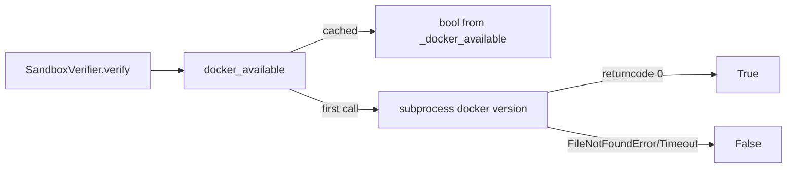

# PRD — Community 568: Sandbox Verifier — Docker Availability Check

## Master Goal Mapping
**ALDECI Pillar:** PoC sandbox verifier — lazily checks whether Docker is accessible on the host system, caching the result to avoid repeated subprocess calls during batch PoC verification.

## Architecture Diagram


## Code Proof
**File:** `suite-core/core/sandbox_verifier.py:L212`  
**Module:** `sandbox_verifier.SandboxVerifier.docker_available`

```python
@property
def docker_available(self) -> bool:
    """Check if Docker is available on this system."""
    if self._docker_available is not None:
        return self._docker_available
    try:
        result = subprocess.run(
            ["docker", "version", "--format", "{{.Server.Version}}"],
            capture_output=True, text=True, timeout=5,
        )
        self._docker_available = result.returncode == 0
    except (FileNotFoundError, subprocess.TimeoutExpired):
        self._docker_available = False
    return self._docker_available
```

## Inter-Dependencies
- `SandboxVerifier.verify()` — checks `docker_available` before container execution
- `_validate_poc_code()` — sibling validation step
- C569 `_sanitize_template_str` — sibling security helper

## Data Flow
First access → subprocess `docker version` → cache result → subsequent accesses return cached bool without subprocess.

## Referenced Docs
- ALDECI Rearchitecture v2 §PoC Sandbox Execution
- Docker Engine API
- Subprocess security best practices

## Acceptance Criteria
- [ ] Docker installed → `True`
- [ ] Docker not installed → `False` (FileNotFoundError caught)
- [ ] Docker timeout → `False` (TimeoutExpired caught)
- [ ] Second call returns cached value (no subprocess)
- [ ] Thread-safe property read

## Effort Estimate
S — 1 day (implemented; add mock-subprocess test)

## Status
DONE — implemented at L212
