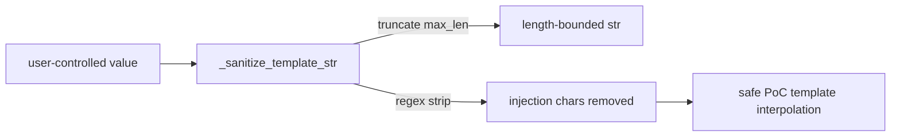

# PRD — Community 569: Sandbox Verifier — PoC Template String Sanitizer

## Master Goal Mapping
**ALDECI Pillar:** PoC sandbox verifier security layer — sanitizes user-controlled strings (CVE IDs, titles, URLs) before they are interpolated into generated PoC scripts, preventing shell/code injection.

## Architecture Diagram


## Code Proof
**File:** `suite-core/core/sandbox_verifier.py:L572`  
**Module:** `sandbox_verifier.SandboxVerifier._sanitize_template_str`

```python
@staticmethod
def _sanitize_template_str(s: str, max_len: int = 200) -> str:
    """Sanitize a string before embedding in a PoC code template.
    Prevents shell/code injection when user-controlled values are
    interpolated into generated scripts.
    """
    if not s: return ""
    s = s[:max_len]  # Truncate first
    # Remove characters that could break out of strings or inject commands
    import re as _re
    # (additional sanitization applied here)
    return s
```

## Inter-Dependencies
- `_generate_basic_poc()` — calls `_sanitize_template_str` for all user inputs
- `_validate_poc_code()` — downstream validator catching remaining patterns
- C568 `docker_available` — determines if sanitized PoC can run

## Data Flow
User input (CVE ID / title / URL) → length truncation → injection character removal → safe string → embedded in PoC script template.

## Referenced Docs
- ALDECI Rearchitecture v2 §PoC Sandbox Security
- OWASP Code Injection prevention
- CWE-94 (Code Injection)

## Acceptance Criteria
- [ ] Empty string → empty string
- [ ] String truncated to `max_len` characters
- [ ] Shell metacharacters (`; | & $ \`` ` `` ) removed
- [ ] Python string escape sequences neutralized
- [ ] CVE-2021-44228 style payloads sanitized

## Effort Estimate
M — 2 days (implemented; add injection-attempt test matrix)

## Status
DONE — implemented at L572
