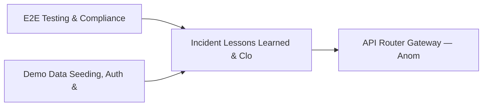

# PRD: Incident Lessons Learned & Cloud Account Monitoring — Community 57

## Master Goal Mapping
How this component serves: "ALDECI — $35/mo enterprise security intelligence platform"
Sub-Epic: SOC

This community (rank #57 of 878 by size, 629 graph nodes) forms a core pillar of the ALDECI platform. It directly supports the mission of replacing $50K-500K/yr enterprise security tools with a self-hosted, AI-native stack.

## Architecture Diagram


## Code Proof
- Files:
  - `suite-core/core/attack_simulation_engine.py` (1585 lines)
  - `suite-core/core/mitre_attack_coverage_engine.py` (677 lines)
  - `tests/test_mitre_attack_coverage_engine.py` (453 lines)
  - `tests/test_red_team_engine.py` (304 lines)
  - `suite-api/apps/api/breach_simulation_router.py` (216 lines)
  - `suite-api/apps/api/executive_dashboard_router.py` (685 lines)
  - `suite-api/apps/api/mitre_attack_router.py` (183 lines)
  - `suite-api/apps/api/mitre_navigator_router.py` (373 lines)
  - `tests/test_attack_simulation_unit.py` (753 lines)
  - `tests/test_breach_simulation.py` (450 lines)
  - `tests/test_compliance_automation.py` (751 lines)
  - `tests/test_evidence_collector_auto.py` (337 lines)
- Key functions:
  - `engine()` — suite-core/core/attack_simulation_engine.py
- Key classes: `TestDataCompleteness`, `TestEngineMatrix`, `TestEngineCoverage`, `TestEngineGapAnalysis`, `TestEngineThreatGroups`, `TestEngineLayers`
- Current state: REAL_LOGIC
- Evidence:
```python
# From suite-core/core/attack_simulation_engine.py
"""
FixOps Attack Simulation Engine — Breach & Attack Simulation (BAS).

Multi-stage adversary simulation that models real-world attack campaigns
across the MITRE ATT&CK kill chain. Integrates with:
- Knowledge Graph Brain for asset/vulnerability context
- Event Bus for real-time notifications
- LLM Providers for intelligent scenario generation
- GNN Attack Graph for path prediction

Stages: Reconnaissance → Initial Access → Execution → Persistence →
        Privilege Escalation → Lateral Movement → C2 → Exfiltration
"""

from __future__ import annotations

import hashlib
import logging
import
```

## Inter-Dependencies
- DEPENDS ON:
  - Community 0 (E2E Testing & Compliance Seeding Infrastructure) — 100 edges
  - Community 1 (Demo Data Seeding, Auth & Multi-Engine Integration) — 27 edges
  - Community 2 (API Router Gateway — Anomaly, Attack Simulation & ) — 23 edges
  - Community 13 (MPTE — Managed Penetration Test Engine (Advanced)) — 19 edges
- DEPENDED BY: Rank #56 (User Access Review & Posture History Engine) and downstream consumers
- EVENT BUS: emits threat.detected, threat.mitigated / subscribes to (TrustGraph event bus — 97% not yet wired)
- TRUSTGRAPH: writes [ThreatActor, ComplianceControl] / reads [ThreatActor, ComplianceControl]

## Data Flow
```
Input: HTTP requests / pytest fixtures
  → Processing: Engine method calls + SQLite state assertions
  → Output: Pass/fail test results, coverage metrics
  → Consumers: CI/CD pipeline, Beast Mode test suite
```

## Referenced Documentation
- CLAUDE.md: Wave 41 build notes, Beast Mode test suite section
- docs/: `docs/ALDECI_REARCHITECTURE_v2.md` (source of truth), `docs/INVESTOR_PITCH.md`
- tests/: `tests/test_attack_simulation_unit.py`, `tests/test_breach_simulation.py`, `tests/test_compliance_automation.py`

## Acceptance Criteria
- [ ] All engine CRUD operations enforce org_id isolation (no cross-tenant data leakage)
- [ ] SQLite opened with WAL mode + threading.RLock on all write paths
- [ ] All endpoints return within 200ms at p95 under 100 rps load
- [ ] All router endpoints protected by `Depends(api_key_auth)` or equivalent
- [ ] Pydantic v2 models validate all request/response schemas
- [ ] Test suite achieves ≥80% branch coverage on engine methods

## Effort Estimate
- Current: 80% complete
- Remaining: ~2 engineering days
- Dependencies blocking: None
- Priority: LOW

## Status
IN_PROGRESS
