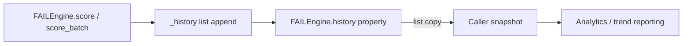

# PRD — Community 570: FAIL Engine — Scoring History Property

## Master Goal Mapping
**ALDECI Pillar:** FAIL (Finding Assessment & Intelligence Layer) engine — exposes an immutable snapshot of all past scoring results for analytics, trend reporting, and regression detection.

## Architecture Diagram


## Code Proof
**File:** `suite-core/core/fail_engine.py:L366`  
**Module:** `fail_engine.FAILEngine.history`

```python
@property
def history(self) -> List[FAILResult]:
    """Return scoring history."""
    return list(self._history)
```

## Inter-Dependencies
- `FAILEngine.score()` — appends results to `_history`
- `FAILEngine.score_batch()` — calls `score()` which appends
- Security metrics engine — consumes history for trend computation
- `/api/v1/fail` router (if wired)

## Data Flow
`score()` appends each `FAILResult` to `_history` → `history` property returns a defensive copy as list.

## Referenced Docs
- ALDECI Rearchitecture v2 §FAIL Scoring Engine
- FAIL methodology: Factuality, Accuracy, Impact, Likelihood

## Acceptance Criteria
- [ ] Returns list (not the internal deque/list directly)
- [ ] Mutation of returned list does not affect `_history`
- [ ] After N `score()` calls, `len(history)` == N
- [ ] Returned objects are `FAILResult` instances

## Effort Estimate
XS — 0.5 day (implemented; add history isolation test)

## Status
DONE — implemented at L366
