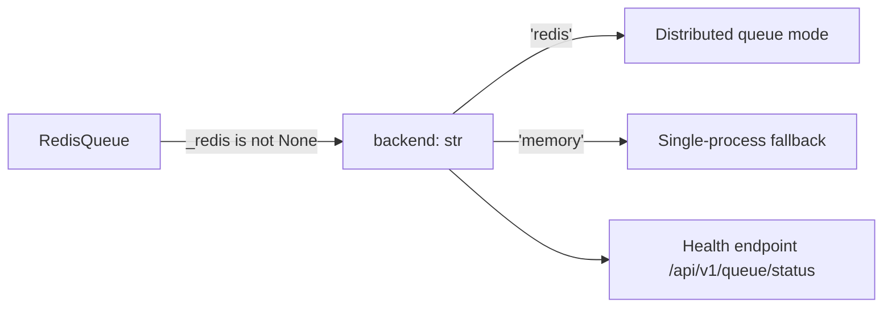

# PRD — Community 573: Redis Queue — Backend Mode Property

## Master Goal Mapping
**ALDECI Pillar:** Horizontal scaling layer — reports whether the queue is backed by Redis or in-memory fallback, enabling health endpoints and operators to verify distributed queue availability.

## Architecture Diagram


## Code Proof
**File:** `suite-core/core/redis_queue.py:L81`  
**Module:** `redis_queue.RedisQueue.backend`

```python
@property
def backend(self) -> str:
    """Return 'redis' or 'memory' depending on availability."""
    return "redis" if self._redis is not None else "memory"
```

## Inter-Dependencies
- `RedisQueue.__init__()` — sets `_redis` if connection succeeds
- `/api/v1/queue` router — exposes backend in status response
- Horizontal scaling health check — alerts if `memory` (single-node)
- Org-scoped task keys — only meaningful in `redis` mode

## Data Flow
Redis connection check → string literal `'redis'` or `'memory'` → returned to health monitor or caller.

## Referenced Docs
- ALDECI Rearchitecture v2 §Horizontal Scaling
- Redis Sentinel / cluster availability docs

## Acceptance Criteria
- [ ] Redis connected → returns `'redis'`
- [ ] Redis unavailable → returns `'memory'`
- [ ] Return type is exactly `str` (not bool)
- [ ] Property has no side effects

## Effort Estimate
XS — 0.5 day (implemented; add connectivity-mock test)

## Status
DONE — implemented at L81
