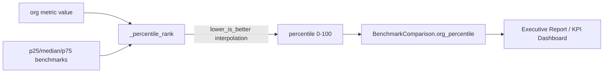

# PRD — Community 574: Security Metrics — Percentile Rank Estimator

## Master Goal Mapping
**ALDECI Pillar:** Security KPI benchmarking — estimates which industry percentile an org's metric value falls into using p25/median/p75 interpolation, supporting both lower-is-better (MTTD/MTTR) and higher-is-better metrics.

## Architecture Diagram


## Code Proof
**File:** `suite-core/core/security_metrics.py:L885`  
**Module:** `security_metrics.SecurityMetricsEngine._percentile_rank`

```python
@staticmethod
def _percentile_rank(value, p25, median, p75, lower_is_better=True) -> float:
    """Estimate which percentile the org falls into (0-100)."""
    if lower_is_better:
        if value <= p25: return 75.0 + 25.0 * max(0.0, (p25-value)/p25)
        if value <= median: return 50.0 + 25.0*(median-value)/max(median-p25,1e-9)
        if value <= p75: return 25.0 + 25.0*(p75-value)/max(p75-median,1e-9)
        return max(0.0, 25.0*p75/max(value,1e-9))
    else:
        if value >= p75: return 75.0
        if value >= median: return 50.0
        if value >= p25: return 25.0
        return max(0.0, 25.0*value/max(p25,1e-9))
```

## Inter-Dependencies
- `compute_benchmark_comparison()` — calls `_percentile_rank` for each metric
- `BenchmarkComparison` dataclass — stores `org_percentile`
- C578 `_derive_top_risks` — uses percentile < 25 as risk signal
- C576 `_report_window` — feeds into same report

## Data Flow
Org value + industry quartile benchmarks → interpolation formula → percentile score → embedded in `BenchmarkComparison` → executive report.

## Referenced Docs
- ALDECI Rearchitecture v2 §Security KPI Benchmarking
- Industry benchmark data sources (Ponemon, Verizon DBIR)
- Percentile interpolation methodology

## Acceptance Criteria
- [ ] Value at p25 (lower-is-better) → ~75th percentile
- [ ] Value at median → ~50th percentile
- [ ] Value much worse than p75 → near 0
- [ ] Zero denominator handled (1e-9 guard)
- [ ] Higher-is-better: value ≥ p75 → 75.0

## Effort Estimate
M — 2 days (implemented; add parametrized percentile test matrix)

## Status
DONE — implemented at L885
