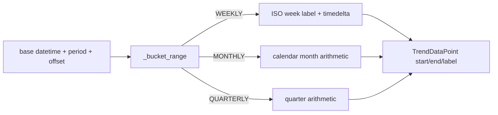

# PRD — Community 575: Security Metrics — Trend Bucket Range Calculator

## Master Goal Mapping
**ALDECI Pillar:** Security KPI trend visualization — computes (start, end, label) for each weekly/monthly/quarterly time bucket, enabling consistent time-series chart data generation.

## Architecture Diagram


## Code Proof
**File:** `suite-core/core/security_metrics.py:L977`  
**Module:** `security_metrics.SecurityMetricsEngine._bucket_range`

```python
@staticmethod
def _bucket_range(base, period, offset) -> Tuple[datetime, datetime, str]:
    """Return (end, start, label) for the Nth-previous bucket."""
    if period == TrendPeriod.WEEKLY:
        end = base - timedelta(weeks=offset)
        start = end - timedelta(weeks=1)
        label = f"{start.year}-W{start.isocalendar()[1]:02d}"
    elif period == TrendPeriod.MONTHLY:
        y, m = divmod(base.month - 1 - offset, 12)
        year = base.year + y; month = m + 1
        start = datetime(year, month, 1, tzinfo=timezone.utc)
        end = datetime(year, month+1 if month<12 else 1, 1, ...)
        label = f"{year}-{month:02d}"
    # ... QUARTERLY handled similarly
```

## Inter-Dependencies
- `get_trend_data()` — calls `_bucket_range(base, period, N)` for each bucket
- `TrendDataPoint` dataclass — stores start/end/label
- Executive report trend section — consumes trend data
- C576 `_report_window` — sibling time computation method

## Data Flow
Base datetime + period enum + offset integer → calendar arithmetic → (start, end, label) tuple → `TrendDataPoint` construction.

## Referenced Docs
- ALDECI Rearchitecture v2 §Security Trend Analytics
- ISO 8601 week numbering
- Python `datetime.isocalendar()` docs

## Acceptance Criteria
- [ ] Weekly offset=0 → current week range and ISO label
- [ ] Monthly offset=1 → previous calendar month
- [ ] Monthly December boundary handled (month 12 → Jan next year)
- [ ] Quarterly offset=1 → previous quarter
- [ ] Labels human-readable (e.g., `2026-W15`, `2026-03`)

## Effort Estimate
M — 2 days (implemented; add boundary month/quarter tests)

## Status
DONE — implemented at L977
