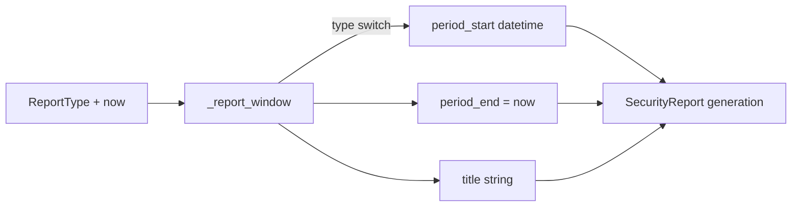

# PRD — Community 576: Security Metrics — Report Period Window Calculator

## Master Goal Mapping
**ALDECI Pillar:** Executive reporting — derives (period_start, period_end, title) for weekly/monthly/quarterly/annual reports from the current datetime, ensuring consistent report headers.

## Architecture Diagram


## Code Proof
**File:** `suite-core/core/security_metrics.py:L1215`  
**Module:** `security_metrics.SecurityMetricsEngine._report_window`

```python
@staticmethod
def _report_window(report_type, now) -> Tuple[datetime, datetime, str]:
    """Return (period_start, period_end, title) for the report type."""
    if report_type == ReportType.WEEKLY_DIGEST:
        return now - timedelta(weeks=1), now, f"Weekly Security Digest — {now.strftime('%Y-%m-%d')}"
    if report_type == ReportType.MONTHLY_EXECUTIVE:
        return now - timedelta(days=30), now, f"Monthly Executive Security Summary — {now.strftime('%B %Y')}"
    if report_type == ReportType.QUARTERLY_BOARD:
        q = ((now.month-1)//3)+1
        return now-timedelta(days=90), now, f"Q{q} {now.year} Board Security Report"
    # ANNUAL_REVIEW
    return now-timedelta(days=365), now, f"Annual Security Review — {now.year}" 
```

## Inter-Dependencies
- `generate_report()` — calls `_report_window` to set report period
- C577 `_build_sections` — receives period bounds for data filtering
- C578 `_derive_top_risks` — uses same report context
- Executive Reporting dashboard — displays generated title

## Data Flow
Report type enum + current datetime → period arithmetic → (start, end, title) tuple → fed into report section builder.

## Referenced Docs
- ALDECI Rearchitecture v2 §Executive Reporting
- CISO reporting best practices
- Board security report templates

## Acceptance Criteria
- [ ] WEEKLY_DIGEST → 7-day window with date in title
- [ ] MONTHLY_EXECUTIVE → 30-day window with month/year in title
- [ ] QUARTERLY_BOARD → 90-day window with Q number in title
- [ ] ANNUAL_REVIEW → 365-day window with year in title
- [ ] period_end always equals `now`

## Effort Estimate
S — 1 day (implemented; add report type parametrized test)

## Status
DONE — implemented at L1215
