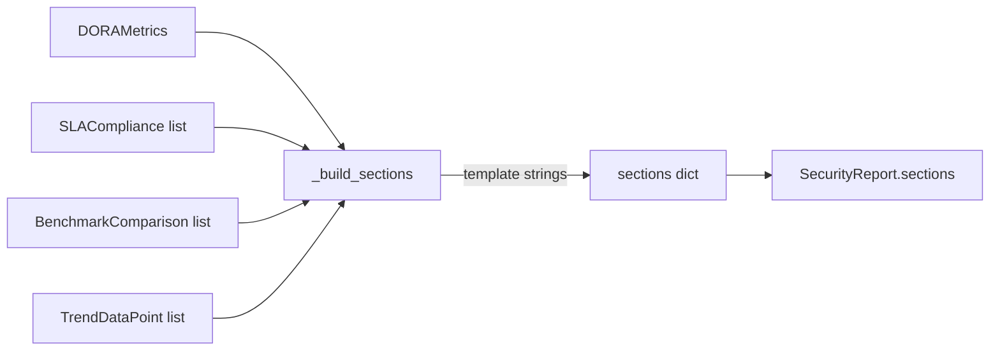

# PRD — Community 577: Security Metrics — Template-Driven Report Section Builder

## Master Goal Mapping
**ALDECI Pillar:** Executive reporting — assembles all narrative sections (executive summary, DORA metrics, SLA analysis, benchmarks, trend analysis) from structured data into a report dict.

## Architecture Diagram


## Code Proof
**File:** `suite-core/core/security_metrics.py:L1240`  
**Module:** `security_metrics.SecurityMetricsEngine._build_sections`

```python
@staticmethod
def _build_sections(report_type, dora, sla, benchmarks, trend, objectives, extra) -> Dict[str, str]:
    """Build template-driven report sections."""
    sections = {}
    # Executive Summary
    critical_sla = next((s for s in sla if s.severity == Severity.CRITICAL), None)
    sections["executive_summary"] = (
        f"Period MTTD: {dora.mttd_hours:.1f}h | MTTR: {dora.mttr_hours:.1f}h | ..."
    )
    # DORA Metrics
    sections["dora_metrics"] = (
        f"MTTD: {dora.mttd_hours:.1f}h\nMTTR: {dora.mttr_hours:.1f}h\n..."
    )
    # ... SLA, benchmarks, trend sections
    return sections
```

## Inter-Dependencies
- `generate_report()` — calls `_build_sections` after computing metrics
- C576 `_report_window` — determines period context
- C578 `_derive_top_risks` — feeds into risk section
- Executive Reporting Dashboard — renders section text

## Data Flow
Structured metrics objects → template string formatting per section → dict of section name → narrative text → embedded in `SecurityReport`.

## Referenced Docs
- ALDECI Rearchitecture v2 §Executive Reporting
- DORA metrics definitions (MTTD/MTTR/MTTC)
- CISO board reporting frameworks

## Acceptance Criteria
- [ ] `executive_summary` section always present
- [ ] `dora_metrics` includes MTTD and MTTR
- [ ] SLA section references critical severity breach rate
- [ ] No KeyError if optional data missing
- [ ] Sections dict has consistent key names

## Effort Estimate
M — 2 days (implemented; add section completeness test)

## Status
DONE — implemented at L1240
