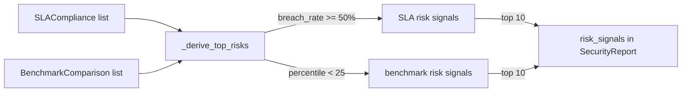

# PRD — Community 578: Security Metrics — Top Risk Signal Derivation

## Master Goal Mapping
**ALDECI Pillar:** Executive reporting risk analysis — identifies the top 10 risk signals from SLA breach rates and below-p25 benchmark metrics, producing actionable CISO-level risk statements.

## Architecture Diagram


## Code Proof
**File:** `suite-core/core/security_metrics.py:L1322`  
**Module:** `security_metrics.SecurityMetricsEngine._derive_top_risks`

```python
@staticmethod
def _derive_top_risks(sla, benchmarks) -> List[str]:
    """Identify top risk signals from SLA and benchmark data."""
    risks = []
    for s in sla:
        if s.breach_rate_pct >= 50.0 and s.total_findings > 0:
            risks.append(f"High {s.severity.value} SLA breach rate ({s.breach_rate_pct:.0f}%) — worst: {s.worst_offender_team}")
    for b in benchmarks:
        if b.org_percentile < 25.0:
            risks.append(f"{b.metric_name} below industry 25th percentile (org: {b.org_value:.1f}, median: {b.industry_median:.1f})")
    if not risks:
        risks.append("No critical risk signals detected in this period")
    return risks[:10]
```

## Inter-Dependencies
- C577 `_build_sections` — receives risk signals for report narrative
- C574 `_percentile_rank` — produces `org_percentile` used here
- `SecurityReport.risk_signals` — stores derived list
- CISO executive dashboard — displays top risks

## Data Flow
SLA + benchmark data → threshold evaluation → risk statement generation → capped at 10 → embedded in report.

## Referenced Docs
- ALDECI Rearchitecture v2 §Risk Reporting
- SLA breach threshold definitions
- Industry benchmark data (Ponemon / Verizon DBIR)

## Acceptance Criteria
- [ ] SLA breach ≥ 50% → included in risks
- [ ] Benchmark below p25 → included in risks
- [ ] Empty data → single 'no critical signals' message
- [ ] Output capped at 10 items
- [ ] Each risk statement is human-readable string

## Effort Estimate
S — 1 day (implemented; add risk detection test with mock data)

## Status
DONE — implemented at L1322
