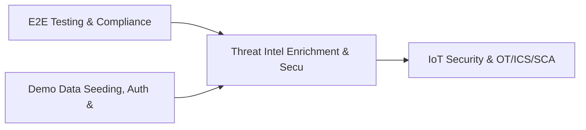

# PRD: Threat Intel Enrichment & Security OKR Engine — Community 58

## Master Goal Mapping
How this component serves: "ALDECI — $35/mo enterprise security intelligence platform"
Sub-Epic: Executive

This community (rank #58 of 878 by size, 625 graph nodes) forms a core pillar of the ALDECI platform. It directly supports the mission of replacing $50K-500K/yr enterprise security tools with a self-hosted, AI-native stack.

## Architecture Diagram


## Code Proof
- Files:
  - `suite-api/apps/api/regulatory_tracker_engine_router.py` (224 lines)
  - `suite-core/core/bug_bounty_engine.py` (556 lines)
  - `suite-core/core/cyber_threat_intelligence_engine.py` (363 lines)
  - `suite-core/core/kpi_tracking_engine.py` (419 lines)
  - `suite-core/core/regulatory_reporting_engine.py` (369 lines)
  - `suite-core/core/threat_feed_subscription_engine.py` (427 lines)
  - `tests/test_bug_bounty_engine.py` (302 lines)
  - `tests/test_cyber_threat_intelligence_engine.py` (290 lines)
  - `suite-api/apps/api/cve_enrichment_router.py` (84 lines)
  - `suite-api/apps/api/cyber_threat_intelligence_router.py` (151 lines)
  - `suite-api/apps/api/executive_reporting_router.py` (283 lines)
  - `suite-api/apps/api/kpi_tracking_router.py` (145 lines)
- Key functions:
  - `engine()` — suite-api/apps/api/regulatory_tracker_engine_router.py
  - `_report()` — suite-api/apps/api/regulatory_tracker_engine_router.py
  - `test_create_report_missing_title_raises()` — suite-api/apps/api/regulatory_tracker_engine_router.py
  - `test_create_report_empty_title_raises()` — suite-api/apps/api/regulatory_tracker_engine_router.py
  - `test_create_report_invalid_intel_type_raises()` — suite-api/apps/api/regulatory_tracker_engine_router.py
  - `test_create_report_invalid_tlp_raises()` — suite-api/apps/api/regulatory_tracker_engine_router.py
  - `test_create_report_invalid_source_type_raises()` — suite-api/apps/api/regulatory_tracker_engine_router.py
  - `test_create_report_all_intel_types()` — suite-api/apps/api/regulatory_tracker_engine_router.py
- Key classes: N/A
- Current state: REAL_LOGIC
- Evidence:
```python
# From suite-api/apps/api/regulatory_tracker_engine_router.py
"""
Regulatory Change Tracker Engine API router.

Endpoints for tracking regulatory changes, compliance obligations, and assessments.

Prefix: /api/v1/regulatory-tracker
"""
from __future__ import annotations

import logging
import os
from typing import Any, Dict, List, Optional

from fastapi import APIRouter, Depends, HTTPException, Query
from pydantic import BaseModel, Field

logger = logging.getLogger(__name__)

router = APIRouter(prefix="/api/v1/regulatory-tracker", tags=["regulatory-tracker"])
```

## Inter-Dependencies
- DEPENDS ON:
  - Community 0 (E2E Testing & Compliance Seeding Infrastructure) — 90 edges
  - Community 1 (Demo Data Seeding, Auth & Multi-Engine Integration) — 19 edges
  - Community 27 (IoT Security & OT/ICS/SCADA Engine) — 13 edges
  - Community 25 (Cloud Workload Protection & Firmware Security) — 9 edges
- DEPENDED BY: Rank #57 (Incident Lessons Learned & Cloud Account Monitoring) and downstream consumers
- EVENT BUS: emits threat.detected, threat.mitigated / subscribes to (TrustGraph event bus — 97% not yet wired)
- TRUSTGRAPH: writes [Vulnerability, ThreatActor] / reads [Vulnerability, ThreatActor]

## Data Flow
```
Input: HTTP requests / pytest fixtures
  → Processing: Engine method calls + SQLite state assertions
  → Output: Pass/fail test results, coverage metrics
  → Consumers: CI/CD pipeline, Beast Mode test suite
```

## Referenced Documentation
- CLAUDE.md: Wave 41 build notes, Beast Mode test suite section
- docs/: `docs/ALDECI_REARCHITECTURE_v2.md` (source of truth), `docs/INVESTOR_PITCH.md`
- tests/: `tests/test_bug_bounty_engine.py`, `tests/test_cyber_threat_intelligence_engine.py`, `tests/test_executive_reporting_engine.py`

## Acceptance Criteria
- [ ] All engine CRUD operations enforce org_id isolation (no cross-tenant data leakage)
- [ ] SQLite opened with WAL mode + threading.RLock on all write paths
- [ ] All endpoints return within 200ms at p95 under 100 rps load
- [ ] All router endpoints protected by `Depends(api_key_auth)` or equivalent
- [ ] Pydantic v2 models validate all request/response schemas
- [ ] Test suite achieves ≥80% branch coverage on engine methods

## Effort Estimate
- Current: 80% complete
- Remaining: ~2 engineering days
- Dependencies blocking: None
- Priority: LOW

## Status
IN_PROGRESS
