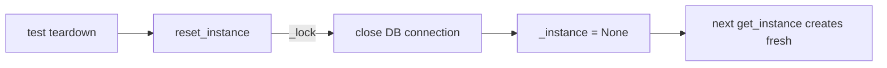

# PRD — Community 580: KnowledgeBrain — Singleton Reset (Test Teardown)

## Master Goal Mapping
**ALDECI Pillar:** TrustGraph knowledge layer — tears down the singleton `KnowledgeBrain` instance by closing the DB connection and clearing `_instance`, enabling isolated unit tests.

## Architecture Diagram


## Code Proof
**File:** `suite-core/core/knowledge_brain.py:L201`  
**Module:** `knowledge_brain.KnowledgeBrain.reset_instance`

```python
@classmethod
def reset_instance(cls) -> None:
    """Reset the singleton (for testing)."""
    with cls._lock:
        if cls._instance is not None:
            cls._instance.close()
            cls._instance = None
```

## Inter-Dependencies
- `KnowledgeBrain.get_instance()` — C579, creates what reset destroys
- `KnowledgeBrain.close()` — closes SQLite connection
- All test files using `KnowledgeBrain` — call `reset_instance()` in `teardown`

## Data Flow
Test teardown → lock → close SQLite → set `_instance = None` → next `get_instance()` creates fresh object.

## Referenced Docs
- ALDECI Rearchitecture v2 §TrustGraph Testing
- pytest fixture teardown patterns

## Acceptance Criteria
- [ ] After reset, `_instance` is `None`
- [ ] DB connection closed before reset
- [ ] Second reset call is a no-op (not error)
- [ ] Thread-safe under lock
- [ ] Subsequent `get_instance()` creates new object

## Effort Estimate
XS — 0.5 day (implemented; add reset-then-recreate test)

## Status
DONE — implemented at L201
