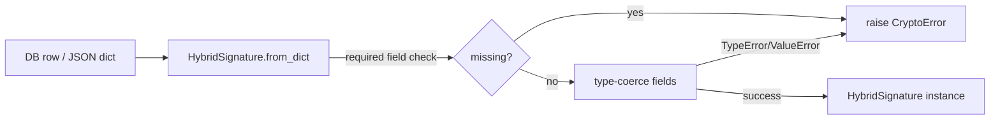

# PRD — Community 588: Crypto — HybridSignature Deserializer

## Master Goal Mapping
**ALDECI Pillar:** Post-quantum hybrid cryptography layer — reconstructs a `HybridSignature` from a plain dict (loaded from DB or JSON), with strict field validation and typed error reporting.

## Architecture Diagram


## Code Proof
**File:** `suite-core/core/crypto.py:L226`  
**Module:** `crypto.HybridSignature.from_dict`

```python
@classmethod
def from_dict(cls, d: Dict[str, Any]) -> "HybridSignature":
    """Deserialise from a plain dict."""
    required = ("format_version","algorithm","classical_sig","pq_sig","key_fingerprint")
    missing = [k for k in required if k not in d]
    if missing:
        raise CryptoError(f"HybridSignature.from_dict: missing fields: {missing}")
    try:
        return cls(
            format_version=int(d["format_version"]),
            algorithm=str(d["algorithm"]),
            classical_sig=str(d["classical_sig"]),
            pq_sig=str(d["pq_sig"]),
            key_fingerprint=str(d["key_fingerprint"]),
            created_at=d.get("created_at", datetime.now(timezone.utc).isoformat()),
        )
    except (TypeError, ValueError) as exc:
        raise CryptoError(f"HybridSignature.from_dict: invalid field type: {exc}") from exc
```

## Inter-Dependencies
- `SignatureChain.from_dict()` — C606, calls this for each entry's signature
- Evidence vault — loads signatures from WORM chain records
- `HybridVerifier.verify_hybrid()` — receives `HybridSignature` objects
- C589 `VerificationResult.failure` — error path companion

## Data Flow
Serialized dict → required field validation → type coercion → `HybridSignature` dataclass → used for verification.

## Referenced Docs
- ALDECI Rearchitecture v2 §Post-Quantum Cryptography
- NIST FIPS 204 (ML-DSA)
- Hybrid classical+PQ signature scheme design

## Acceptance Criteria
- [ ] Valid dict → `HybridSignature` instance
- [ ] Missing required field → `CryptoError` with field name
- [ ] Wrong field type → `CryptoError` (not raw TypeError)
- [ ] `created_at` defaults to now if missing
- [ ] Round-trip: `from_dict(sig.to_dict()) == sig`

## Effort Estimate
M — 2 days (implemented; add round-trip serialization test)

## Status
DONE — implemented at L226
