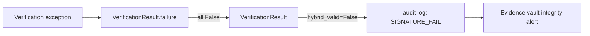

# PRD — Community 589: Crypto — Verification Result Failure Factory

## Master Goal Mapping
**ALDECI Pillar:** Post-quantum hybrid cryptography layer — creates a uniformly-failed `VerificationResult` with all validity flags set to `False`, ensuring consistent failure representation across RSA and ML-DSA verification paths.

## Architecture Diagram


## Code Proof
**File:** `suite-core/core/crypto.py:L292`  
**Module:** `crypto.VerificationResult.failure`

```python
@classmethod
def failure(cls, algorithm: str, fingerprint: str, detail: str) -> "VerificationResult":
    """Create a uniformly-failed result with an error detail."""
    return cls(
        classical_valid=False,
        pq_valid=False,
        hybrid_valid=False,
        algorithm=algorithm,
        key_fingerprint=fingerprint,
        error_detail=detail,
    )
```

## Inter-Dependencies
- `HybridVerifier.verify_hybrid()` — calls `failure()` on any exception
- `RSAVerifier.verify()` — uses for RSA-specific failures
- `MLDSAVerifier.verify()` — uses for PQ-specific failures
- Evidence vault — treats `hybrid_valid=False` as tamper alert

## Data Flow
Caught crypto exception → `failure()` factory → `VerificationResult` with all False flags + error detail → caller checks `hybrid_valid`.

## Referenced Docs
- ALDECI Rearchitecture v2 §Post-Quantum Cryptography
- Evidence chain tamper detection
- Hybrid signature verification protocol

## Acceptance Criteria
- [ ] `classical_valid` = `False`
- [ ] `pq_valid` = `False`
- [ ] `hybrid_valid` = `False`
- [ ] `error_detail` set to provided `detail` string
- [ ] `algorithm` and `key_fingerprint` preserved

## Effort Estimate
XS — 0.5 day (implemented; add factory assertion test)

## Status
DONE — implemented at L292
