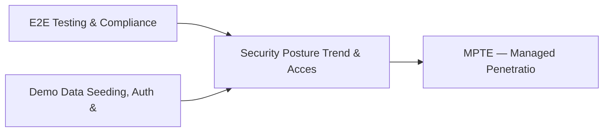

# PRD: Security Posture Trend & Access Governance Engine — Community 59

## Master Goal Mapping
How this component serves: "ALDECI — $35/mo enterprise security intelligence platform"
Sub-Epic: Network

This community (rank #60 of 878 by size, 566 graph nodes) forms a core pillar of the ALDECI platform. It directly supports the mission of replacing $50K-500K/yr enterprise security tools with a self-hosted, AI-native stack.

## Architecture Diagram


## Code Proof
- Files:
  - `suite-core/core/evidence_chain_engine.py` (466 lines)
  - `suite-core/core/evidence_vault_engine.py` (451 lines)
  - `tests/test_compliance_mapping_engine.py` (485 lines)
  - `tests/test_digital_forensics_engine.py` (341 lines)
  - `tests/test_evidence_chain_engine.py` (307 lines)
  - `tests/test_evidence_vault_engine.py` (467 lines)
  - `suite-api/apps/api/auto_evidence_router.py` (183 lines)
  - `suite-api/apps/api/compliance_evidence_router.py` (222 lines)
  - `suite-api/apps/api/evidence_chain_router.py` (276 lines)
  - `suite-api/apps/api/evidence_collector_router.py` (326 lines)
  - `suite-api/apps/api/evidence_vault_router.py` (184 lines)
  - `suite-evidence-risk/api/evidence_router.py` (2046 lines)
- Key functions:
  - `tmp_collector()` — suite-core/core/evidence_chain_engine.py
  - `setup_app()` — suite-core/core/evidence_chain_engine.py
  - `test_evidence_isolated_by_org()` — suite-core/core/evidence_chain_engine.py
  - `engine()` — suite-core/core/evidence_chain_engine.py
  - `test_init_creates_db()` — suite-core/core/evidence_chain_engine.py
  - `test_init_idempotent()` — suite-core/core/evidence_chain_engine.py
  - `test_create_request_returns_dict()` — suite-core/core/evidence_chain_engine.py
  - `test_create_request_all_frameworks()` — suite-core/core/evidence_chain_engine.py
- Key classes: `TestEvidenceSourceEnum`, `TestAutoEvidenceModel`, `TestFrameworkControlMap`, `TestAutoEvidenceCollectorPersistence`, `TestAutoCollectAll`, `TestVerifyEvidence`
- Current state: REAL_LOGIC
- Evidence:
```python
# From suite-core/core/evidence_chain_engine.py
"""Evidence Chain Engine — ALDECI.

Digital evidence chain-of-custody tracking for forensics and legal proceedings.
Ensures tamper-evident audit trails from collection through case closure.

Compliance: NIST SP 800-86, ISO/IEC 27037, ACPO Good Practice Guide
"""

from __future__ import annotations

import json
import logging
import sqlite3
import threading
import uuid
from datetime import datetime, timezone
from pathlib import Path
from typing import Any, Dict, List, Optional

try:
```

## Inter-Dependencies
- DEPENDS ON:
  - Community 0 (E2E Testing & Compliance Seeding Infrastructure) — 139 edges
  - Community 1 (Demo Data Seeding, Auth & Multi-Engine Integration) — 26 edges
  - Community 13 (MPTE — Managed Penetration Test Engine (Advanced)) — 19 edges
  - Community 45 (Patch Management & Container Security Posture) — 8 edges
- DEPENDED BY: Rank #59 (Compliance Workflow & Threat Landscape Engine) and downstream consumers
- EVENT BUS: emits compliance.status_changed / subscribes to (TrustGraph event bus — 97% not yet wired)
- TRUSTGRAPH: writes [ComplianceControl] / reads [ComplianceControl]

## Data Flow
```
Input: HTTP requests / pytest fixtures
  → Processing: Engine method calls + SQLite state assertions
  → Output: Pass/fail test results, coverage metrics
  → Consumers: CI/CD pipeline, Beast Mode test suite
```

## Referenced Documentation
- CLAUDE.md: Wave 41 build notes, Beast Mode test suite section
- docs/: `docs/ALDECI_REARCHITECTURE_v2.md` (source of truth), `docs/INVESTOR_PITCH.md`
- tests/: `tests/test_auto_evidence.py`, `tests/test_compliance_evidence_collector.py`, `tests/test_compliance_mapping_engine.py`

## Acceptance Criteria
- [ ] All engine CRUD operations enforce org_id isolation (no cross-tenant data leakage)
- [ ] SQLite opened with WAL mode + threading.RLock on all write paths
- [ ] All endpoints return within 200ms at p95 under 100 rps load
- [ ] All router endpoints protected by `Depends(api_key_auth)` or equivalent
- [ ] Pydantic v2 models validate all request/response schemas
- [ ] Test suite achieves ≥80% branch coverage on engine methods

## Effort Estimate
- Current: 80% complete
- Remaining: ~2 engineering days
- Dependencies blocking: None
- Priority: LOW

## Status
IN_PROGRESS
