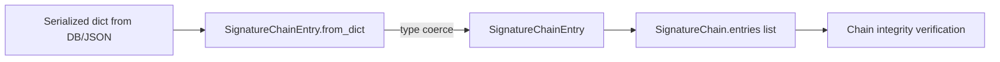

# PRD — Community 590: Crypto — SignatureChainEntry Deserializer

## Master Goal Mapping
**ALDECI Pillar:** Post-quantum evidence chain — reconstructs a `SignatureChainEntry` from a plain dict, enabling tamper-evident audit chain loading from serialized storage.

## Architecture Diagram


## Code Proof
**File:** `suite-core/core/crypto.py:L336`  
**Module:** `crypto.SignatureChainEntry.from_dict`

```python
@classmethod
def from_dict(cls, d: Dict[str, Any]) -> "SignatureChainEntry":
    """Deserialise from plain dict."""
    return cls(
        entry_id=int(d["entry_id"]),
        data_hash=str(d["data_hash"]),
        signature=str(d["signature"]),
        previous_hash=str(d["previous_hash"]),
        algorithm=str(d["algorithm"]),
        timestamp=str(d.get("timestamp", "")),
    )
```

## Inter-Dependencies
- `SignatureChain.from_dict()` — C606, calls this per entry in chain
- Evidence vault — loads full chain from DB and verifies
- C605 `SignatureChain.entries` — stores collection of these
- `EvidenceWORMStore.record()` — creates entries appended here

## Data Flow
Serialized dict → type coercion of all fields → `SignatureChainEntry` dataclass → appended to `SignatureChain.entries` for verification.

## Referenced Docs
- ALDECI Rearchitecture v2 §Evidence Chain
- Hash-linked tamper-evident log design
- WORM (Write Once Read Many) storage pattern

## Acceptance Criteria
- [ ] All 6 fields correctly typed and set
- [ ] `timestamp` defaults to empty string if missing
- [ ] `entry_id` coerced to int
- [ ] Round-trip: `from_dict(entry.to_dict()) == entry`
- [ ] `KeyError` propagates (strict — all fields required except timestamp)

## Effort Estimate
S — 1 day (implemented; add round-trip test)

## Status
DONE — implemented at L336
