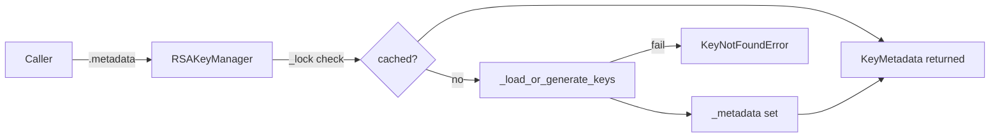

# PRD — Community 593: RSA Key Manager — `metadata` Property

## Master Goal Mapping
**ALDECI Pillar:** Post-quantum hybrid cryptography — provides thread-safe lazy access to the RSA metadata, loading or generating the key pair on first access and caching it for subsequent calls.

## Architecture Diagram


## Code Proof
**File:** `suite-core/core/crypto.py:L460`  
**Module:** `crypto.RSAKeyManager.metadata`

```python
@property
def metadata(self) -> KeyMetadata:
    """Return KeyMetadata for the current key pair."""
    with self._lock:
        if self._metadata is None:
            self._load_or_generate_keys()
    if self._metadata is None:
        raise KeyNotFoundError("RSA metadata not available")
    return self._metadata
```

## Inter-Dependencies
- `_load_or_generate_keys()` — loads from file or generates new RSA key pair
- `RSASigner` — consumes `private_key`
- `RSAVerifier` — consumes `public_key`
- `HybridKeyManager` — aggregates RSAKeyManager for hybrid operations
- C597/C598 — hybrid key ID and fingerprint use RSA key

## Data Flow
First access → lock → `_load_or_generate_keys()` → cache → return `KeyMetadata`; second access → return cached directly.

## Referenced Docs
- ALDECI Rearchitecture v2 §Post-Quantum Cryptography
- NIST SP 800-131A (RSA key strength)
- RSA-SHA256 PKCS#1 v1.5 signing

## Acceptance Criteria
- [ ] First call triggers `_load_or_generate_keys()`
- [ ] Second call returns cached (no re-load)
- [ ] Thread-safe under concurrent access
- [ ] Raises `KeyNotFoundError` if key unavailable
- [ ] Returns `KeyMetadata` instance (not None)

## Effort Estimate
M — 2 days (implemented; add lazy-load and thread-safety tests)

## Status
DONE — implemented at L460
