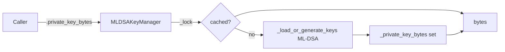

# PRD — Community 595: ML-DSA Key Manager — `private_key_bytes` Property

## Master Goal Mapping
**ALDECI Pillar:** Post-quantum (PQ) cryptography — thread-safe lazy accessor for ML-DSA-65 private key bytes, loading or generating the post-quantum key pair on first access.

## Architecture Diagram


## Code Proof
**File:** `suite-core/core/crypto.py:L969`  
**Module:** `crypto.MLDSAKeyManager.private_key_bytes`

```python
@property
def private_key_bytes(self) -> bytes:
    """Return the raw ML-DSA private key bytes."""
    with self._lock:
        if self._private_key_bytes is None:
            self._load_or_generate_keys()
    if self._private_key_bytes is None:
        raise KeyNotFoundError("ML-DSA private_key_bytes not available")
    return self._private_key_bytes
```

## Inter-Dependencies
- `_load_or_generate_keys()` — calls ML-DSA keygen (FIPS 204 / dilithium-mode)
- `MLDSASigner` — consumes `private_key_bytes` for signing
- `MLDSAVerifier` — consumes `public_key_bytes` for verification
- `HybridKeyManager` — wraps `MLDSAKeyManager` + `RSAKeyManager`
- C598 `combined_fingerprint` — hashes ML-DSA public key

## Data Flow
First access → lock → ML-DSA key generation via FIPS 204 → cache bytes → return `bytes`.

## Referenced Docs
- ALDECI Rearchitecture v2 §Post-Quantum Cryptography
- NIST FIPS 204 (ML-DSA / Dilithium)
- Post-quantum cryptography migration strategy

## Acceptance Criteria
- [ ] First call triggers ML-DSA key generation
- [ ] Cached on subsequent calls
- [ ] `KeyNotFoundError` raised if keygen fails
- [ ] Returns raw `bytes` (not string)
- [ ] Thread-safe under concurrent access

## Effort Estimate
M — 2 days (implemented; add PQ keygen and cache tests)

## Status
DONE — implemented at L969
