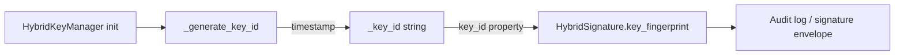

# PRD — Community 597: Hybrid Key Manager — Combined Key Identifier

## Master Goal Mapping
**ALDECI Pillar:** Post-quantum hybrid cryptography — returns the stable time-based string identifier for the hybrid RSA+ML-DSA key pair, used to track key versions in audit logs and signature envelopes.

## Architecture Diagram


## Code Proof
**File:** `suite-core/core/crypto.py:L1079`  
**Module:** `crypto.HybridKeyManager.key_id`

```python
@property
def key_id(self) -> str:
    """Return the combined hybrid key identifier."""
    return self._key_id

def _generate_key_id(self) -> str:
    return f"fixops-hybrid-{datetime.now(timezone.utc).strftime('%Y%m%d%H%M%S')}" 
```

## Inter-Dependencies
- `HybridKeyManager.__init__()` — calls `_generate_key_id()`
- `HybridSigner.sign()` — embeds `key_id` in `HybridSignature`
- `HybridVerifier` — uses `key_id` to retrieve correct key
- C598 `combined_fingerprint` — companion identifier

## Data Flow
Key pair created → time-based `key_id` generated → stored → returned via property → embedded in every signature produced.

## Referenced Docs
- ALDECI Rearchitecture v2 §Post-Quantum Cryptography
- Key versioning and rotation strategy

## Acceptance Criteria
- [ ] Starts with `fixops-hybrid-`
- [ ] Contains UTC timestamp in format `%Y%m%d%H%M%S`
- [ ] Unique per key manager instance (time-based)
- [ ] Immutable after construction (property, no setter)

## Effort Estimate
XS — 0.5 day (implemented; add key_id format validation test)

## Status
DONE — implemented at L1079
