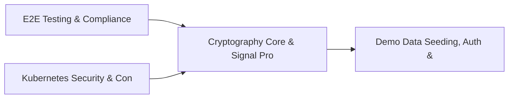

# PRD: Cryptography Core & Signal Processing Library — Community 6

## Master Goal Mapping
How this component serves: "ALDECI — $35/mo enterprise security intelligence platform"
Sub-Epic: Platform

This community (rank #6 of 878 by size, 2638 graph nodes) forms a core pillar of the ALDECI platform. It directly supports the mission of replacing $50K-500K/yr enterprise security tools with a self-hosted, AI-native stack.

## Architecture Diagram


## Code Proof
- Files:
  - `suite-core/core/crypto.py` (2673 lines)
  - `suite-integrations/mpte-aldeci/index-B8aPzWeF.js` (936 lines)
- Key functions:
  - `abort()` — suite-core/core/crypto.py
  - `chain()` — suite-core/core/crypto.py
  - `initialize_signals()` — suite-core/core/crypto.py
  - `initialize_terminating_signals()` — suite-core/core/crypto.py
  - `initialize_shell_signals()` — suite-core/core/crypto.py
  - `reset_terminating_signals()` — suite-core/core/crypto.py
  - `top_level_cleanup()` — suite-core/core/crypto.py
  - `throw_to_top_level()` — suite-core/core/crypto.py
- Key classes: N/A
- Current state: STUB
- Evidence:
```python
# From suite-core/core/crypto.py
"""Production-grade hybrid quantum-secure cryptographic signing and verification.

This module implements FIPS 204 ML-DSA-65 (Dilithium3) combined with RSA-4096-SHA256
for hybrid post-quantum / classical signing of evidence bundles.  It replaces the
RSA-only v1 module while remaining fully backward-compatible with v1 bundle
consumers.

Standards compliance
--------------------
- FIPS 204  — ML-DSA (Module-Lattice Digital Signature Algorithm, formerly Dilithium)
- FIPS 203  — ML-KEM integration points (key encapsulation for envelope encryption)
- FIPS 205  — SLH-DSA hooks (backup / upgrade path
```

## Inter-Dependencies
- DEPENDS ON:
  - Community 0 (E2E Testing & Compliance Seeding Infrastructure) — 54 edges
  - Community 24 (Kubernetes Security & Container Registry Engine) — 9 edges
  - Community 1 (Demo Data Seeding, Auth & Multi-Engine Integration) — 6 edges
  - Community 39 (Vulnerability Correlation & Prioritization Engine) — 5 edges
- DEPENDED BY: Rank #5 (API Bridge, Docs Portal & Cross-Dashboard Infrastructure) and downstream consumers
- EVENT BUS: emits (none currently wired) / subscribes to (TrustGraph event bus — 97% not yet wired)
- TRUSTGRAPH: writes [(not yet integrated)] / reads [(not yet integrated)]

## Data Flow
```
Input: Domain-specific data events
  → Processing: Core business logic + data transformation
  → Output: Structured security insights
  → Consumers: Downstream engines and API consumers
```

## Referenced Documentation
- CLAUDE.md: Wave 12 build notes, Beast Mode test suite section
- docs/: `docs/ALDECI_REARCHITECTURE_v2.md` (source of truth), `docs/INVESTOR_PITCH.md`
- tests/: N/A

## Acceptance Criteria
- [ ] Core functionality implemented and passing unit tests
- [ ] Integration with TrustGraph event bus verified
- [ ] org_id isolation enforced on all multi-tenant operations

## Effort Estimate
- Current: 0% complete
- Remaining: ~15 engineering days
- Dependencies blocking: Engine implementation incomplete, Frontend dashboard not yet created, Test coverage missing
- Priority: HIGH

## Status
TODO
