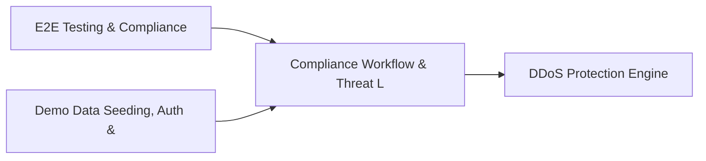

# PRD: Compliance Workflow & Threat Landscape Engine — Community 60

## Master Goal Mapping
How this component serves: "ALDECI — $35/mo enterprise security intelligence platform"
Sub-Epic: Identity

This community (rank #59 of 878 by size, 566 graph nodes) forms a core pillar of the ALDECI platform. It directly supports the mission of replacing $50K-500K/yr enterprise security tools with a self-hosted, AI-native stack.

## Architecture Diagram


## Code Proof
- Files:
  - `suite-api/apps/api/analytics_engine_router.py` (164 lines)
  - `tests/test_security_posture_reporting_engine.py` (419 lines)
  - `suite-api/apps/api/analytics_engine_router.py` (164 lines)
  - `suite-api/apps/api/drp_router.py` (196 lines)
  - `suite-api/apps/api/posture_benchmark_router.py` (177 lines)
  - `suite-api/apps/api/security_posture_reporting_router.py` (202 lines)
  - `suite-api/apps/api/self_scan_router.py` (342 lines)
  - `tests/test_digital_risk_protection.py` (158 lines)
  - `tests/test_posture_benchmark.py` (558 lines)
  - `tests/test_security_posture_reporting_engine.py` (419 lines)
  - `tests/test_self_scan.py` (698 lines)
  - `tests/test_self_scanner.py` (913 lines)
- Key functions:
  - `analyzer()` — suite-api/apps/api/analytics_engine_router.py
  - `test_instantiation()` — suite-api/apps/api/analytics_engine_router.py
  - `test_db_file_created()` — suite-api/apps/api/analytics_engine_router.py
  - `test_analyze_package_returns_dict()` — suite-api/apps/api/analytics_engine_router.py
  - `test_analyze_package_safe_package_low_risk()` — suite-api/apps/api/analytics_engine_router.py
  - `test_analyze_package_known_malicious_ctx()` — suite-api/apps/api/analytics_engine_router.py
  - `test_analyze_package_malicious_specific_version()` — suite-api/apps/api/analytics_engine_router.py
  - `test_analyze_package_malicious_wrong_version_not_flagged()` — suite-api/apps/api/analytics_engine_router.py
- Key classes: N/A
- Current state: REAL_LOGIC
- Evidence:
```python
# From suite-api/apps/api/analytics_engine_router.py
"""Cross-domain analytics engine API endpoints — ALDECI.

Exposes DuckDB-powered cross-domain analytics over all SQLite domain databases.
Auth is injected by app.py via ``app.include_router(..., dependencies=[...])``.

Prefix: /api/v1/analytics-engine
Tags:   analytics-engine
"""

from __future__ import annotations

from typing import Any, Dict, List, Optional

from fastapi import APIRouter, HTTPException, Query

from core.duckdb_analytics_engine import AnalyticsEngine

router = APIRouter(
    prefix="/api/v1/analytics-engine",
    tags=["analytics-engine"],
```

## Inter-Dependencies
- DEPENDS ON:
  - Community 0 (E2E Testing & Compliance Seeding Infrastructure) — 102 edges
  - Community 1 (Demo Data Seeding, Auth & Multi-Engine Integration) — 33 edges
  - Community 16 (DDoS Protection Engine) — 7 edges
  - Community 25 (Cloud Workload Protection & Firmware Security) — 4 edges
- DEPENDED BY: Rank #58 (Threat Intel Enrichment & Security OKR Engine) and downstream consumers
- EVENT BUS: emits (none currently wired) / subscribes to (TrustGraph event bus — 97% not yet wired)
- TRUSTGRAPH: writes [(not yet integrated)] / reads [(not yet integrated)]

## Data Flow
```
Input: HTTP requests / pytest fixtures
  → Processing: Engine method calls + SQLite state assertions
  → Output: Pass/fail test results, coverage metrics
  → Consumers: CI/CD pipeline, Beast Mode test suite
```

## Referenced Documentation
- CLAUDE.md: Wave 41 build notes, Beast Mode test suite section
- docs/: `docs/ALDECI_REARCHITECTURE_v2.md` (source of truth), `docs/INVESTOR_PITCH.md`
- tests/: `tests/test_digital_risk_protection.py`, `tests/test_posture_benchmark.py`, `tests/test_security_posture_reporting_engine.py`

## Acceptance Criteria
- [ ] All engine CRUD operations enforce org_id isolation (no cross-tenant data leakage)
- [ ] SQLite opened with WAL mode + threading.RLock on all write paths
- [ ] All endpoints return within 200ms at p95 under 100 rps load
- [ ] All router endpoints protected by `Depends(api_key_auth)` or equivalent
- [ ] Pydantic v2 models validate all request/response schemas
- [ ] Test suite achieves ≥80% branch coverage on engine methods

## Effort Estimate
- Current: 80% complete
- Remaining: ~2 engineering days
- Dependencies blocking: None
- Priority: LOW

## Status
IN_PROGRESS
