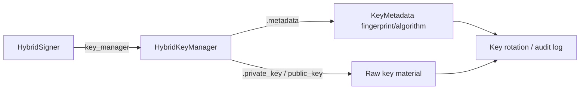

# PRD — Community 603: HybridSigner — `key_manager` Property

## Master Goal Mapping
**ALDECI Pillar:** Post-quantum hybrid cryptography — HybridSigner produces dual RSA+ML-DSA signatures; exposes the underlying `HybridKeyManager` so callers can access key metadata, rotation state, and fingerprints without going through the signer/verifier interface.

## Architecture Diagram


## Code Proof
**File:** `suite-core/core/crypto.py:L1505`  
**Module:** `crypto.HybridSigner.key_manager`

```python
@property
def key_manager(self) -> HybridKeyManager:
    """Return the underlying :HybridKeyManager:.""""""
    return self._km
```

## Inter-Dependencies
- `HybridSigner.__init__()` — accepts optional `HybridKeyManager` parameter
- Caller — accesses `key_manager` to read metadata or rotate keys
- `HybridKeyManager` — for hybrid variants, wraps RSA+MLDSA managers
- Evidence vault / audit logger — reads fingerprint via key_manager

## Data Flow
Simple property returning the underlying `HybridKeyManager` instance injected at construction or created with defaults.

## Referenced Docs
- ALDECI Rearchitecture v2 §Post-Quantum Cryptography
- Key management lifecycle
- Separation of concerns: key mgmt vs. crypto operations

## Acceptance Criteria
- [ ] Returns `HybridKeyManager` instance (not None)
- [ ] Returns same object injected at init
- [ ] No side effects
- [ ] Enables key rotation by swapping manager

## Effort Estimate
XS — 0.5 day (implemented; add property identity test)

## Status
DONE — implemented at L1505
