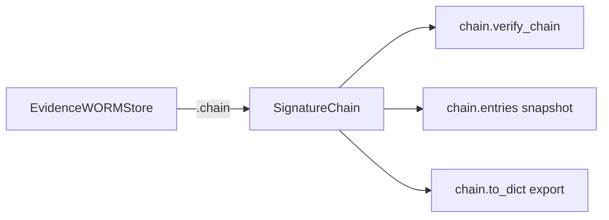

# PRD — Community 607: Evidence WORM Store — Underlying Chain Property

## Master Goal Mapping
**ALDECI Pillar:** Post-quantum tamper-evident evidence storage — exposes the `SignatureChain` backing the WORM store, enabling callers to directly verify integrity, export, or serialize the evidence chain.

## Architecture Diagram


## Code Proof
**File:** `suite-core/core/crypto.py:L2293`  
**Module:** `crypto.EvidenceWORMStore.chain`

```python
@property
def chain(self) -> SignatureChain:
    """Return the underlying SignatureChain.""""""
    return self._chain
```

## Inter-Dependencies
- `EvidenceWORMStore.record()` — appends to `_chain` via `chain.append()`
- `EvidenceWORMStore.verify()` — calls `chain.verify_chain()`
- Evidence vault engine — exports chain via `chain.to_dict()`
- `/api/v1/evidence-vault` router — serves chain integrity status
- C606 `from_dict` — loads chain from persisted store

## Data Flow
Simple property returning the internal `SignatureChain` → caller can verify, export, or serialize the entire evidence chain.

## Referenced Docs
- ALDECI Rearchitecture v2 §Evidence WORM Store
- WORM (Write Once Read Many) storage requirements
- Forensic evidence chain-of-custody

## Acceptance Criteria
- [ ] Returns `SignatureChain` instance (not None)
- [ ] Same object mutated by `record()` calls
- [ ] No side effects
- [ ] Enables full chain verification via `chain.verify_chain()`

## Effort Estimate
XS — 0.5 day (implemented; add chain access test)

## Status
DONE — implemented at L2293
