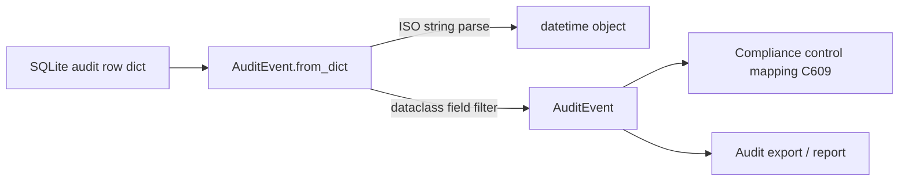

# PRD — Community 608: Audit Logger — AuditEvent Deserializer

## Master Goal Mapping
**ALDECI Pillar:** Enterprise audit logging — reconstructs an `AuditEvent` dataclass from a plain dict (e.g., loaded from SQLite), with ISO timestamp parsing for datetime field coercion.

## Architecture Diagram


## Code Proof
**File:** `suite-core/core/audit_logger.py:L103`  
**Module:** `audit_logger.AuditEvent.from_dict`

```python
@classmethod
def from_dict(cls, data: Dict[str, Any]) -> AuditEvent:
    """Create event from dict (e.g., loaded from DB)."""
    if isinstance(data.get("timestamp"), str):
        data["timestamp"] = datetime.fromisoformat(data["timestamp"])
    return cls(**{k: v for k, v in data.items()
                  if k in cls.__dataclass_fields__})
```

## Inter-Dependencies
- `AuditLogger.get_events()` — calls `from_dict` per row
- `AuditLogger.export_events()` — reconstructs for export
- C609 `get_controls_for_event` — receives `AuditEvent` objects
- RBAC audit log — stores events that this method deserializes

## Data Flow
SQLite dict → timestamp string → `datetime.fromisoformat()` → filter to dataclass fields → `AuditEvent(**kwargs)` construction.

## Referenced Docs
- ALDECI Rearchitecture v2 §Audit Logging
- SOC2 CC6.1 / CC7.2 control requirements
- ISO 8601 datetime format

## Acceptance Criteria
- [ ] ISO string timestamp → `datetime` object
- [ ] Extra dict keys silently ignored (dataclass field filter)
- [ ] Missing optional fields use dataclass defaults
- [ ] `datetime` already → passed through unchanged
- [ ] `AuditEvent` instance returned

## Effort Estimate
S — 1 day (implemented; add deserialization test with timestamp variants)

## Status
DONE — implemented at L103
