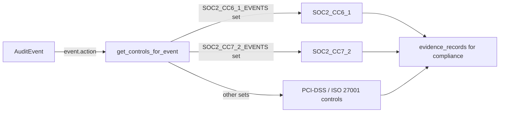

# PRD — Community 609: Audit Logger — Compliance Control Mapper for Audit Events

## Master Goal Mapping
**ALDECI Pillar:** Compliance automation — maps audit event action types to specific compliance control identifiers (SOC2, ISO 27001, PCI-DSS), enabling automated evidence collection tied to audit trails.

## Architecture Diagram


## Code Proof
**File:** `suite-core/core/audit_logger.py:L632`  
**Module:** `audit_logger.ComplianceMapping.get_controls_for_event`

```python
@classmethod
def get_controls_for_event(cls, event: AuditEvent) -> List[str]:
    """Get compliance controls associated with an audit event."""
    controls = []
    if event.action in cls.SOC2_CC6_1_EVENTS:
        controls.append("SOC2_CC6_1")
    if event.action in cls.SOC2_CC7_2_EVENTS:
        controls.append("SOC2_CC7_2")
    # ... additional framework mappings
    return controls
```

## Inter-Dependencies
- `ComplianceMapping.SOC2_CC6_1_EVENTS` — frozenset of action strings
- `ComplianceMapping.SOC2_CC7_2_EVENTS` — frozenset of action strings
- Compliance evidence collector — calls this to link audit events to controls
- `/api/v1/compliance` router — uses event-to-control mapping for reports

## Data Flow
Audit event → action string lookup in framework-specific sets → matching control IDs appended → list returned for evidence linking.

## Referenced Docs
- ALDECI Rearchitecture v2 §Compliance Evidence Auto-Collector
- SOC2 Trust Services Criteria CC6.1 (Logical and Physical Access)
- SOC2 CC7.2 (System Operations)
- ISO 27001 Annex A controls

## Acceptance Criteria
- [ ] `connector.create` action → includes `SOC2_CC6_1`
- [ ] `report.create` action → includes `SOC2_CC7_2`
- [ ] Unmapped action → empty list
- [ ] Same event can map to multiple controls
- [ ] No duplicate controls in output

## Effort Estimate
M — 2 days (implemented; add control-mapping test for all action types)

## Status
DONE — implemented at L632
