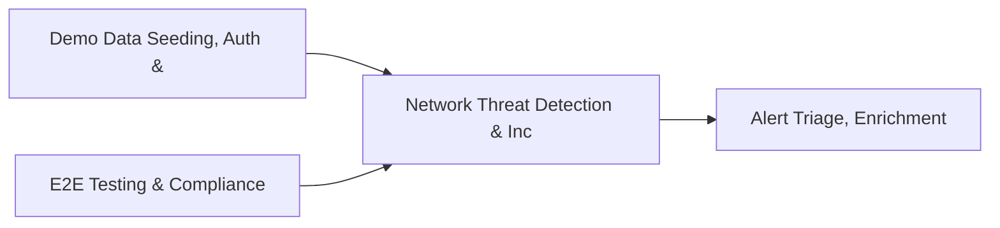

# PRD: Network Threat Detection & Incident Knowledge Base — Community 61

## Master Goal Mapping
How this component serves: "ALDECI — $35/mo enterprise security intelligence platform"
Sub-Epic: GRC

This community (rank #61 of 878 by size, 565 graph nodes) forms a core pillar of the ALDECI platform. It directly supports the mission of replacing $50K-500K/yr enterprise security tools with a self-hosted, AI-native stack.

## Architecture Diagram


## Code Proof
- Files:
  - `suite-core/core/notification_engine.py` (685 lines)
  - `tests/test_notification_engine.py` (276 lines)
  - `tests/test_siem_engine_unit.py` (281 lines)
  - `tests/test_vulnerability_remediation_engine.py` (297 lines)
  - `suite-api/apps/api/ai_orchestrator_router.py` (258 lines)
  - `suite-api/apps/api/stream_router.py` (220 lines)
  - `suite-api/apps/api/websocket_alerts_router.py` (320 lines)
  - `suite-core/api/agents_router.py` (3016 lines)
  - `tests/test_ai_orchestrator.py` (664 lines)
  - `tests/test_brain_pipeline_coverage.py` (660 lines)
  - `tests/test_event_stream.py` (679 lines)
  - `tests/test_notification_engine.py` (276 lines)
- Key functions:
  - `tmp_db()` — suite-core/core/notification_engine.py
  - `orch()` — suite-core/core/notification_engine.py
  - `api_client()` — suite-core/core/notification_engine.py
- Key classes: `TestAgentRole`, `TestAgentTask`, `TestConsensusResult`, `TestRoleTemplates`, `TestCreateTask`, `TestExecuteTask`
- Current state: REAL_LOGIC
- Evidence:
```python
# From suite-core/core/notification_engine.py
"""
Phase 6: Notification Routing Engine for ALDECI.

This module provides intelligent notification routing with:
- Rule-based event filtering and routing
- Multiple notification channels (WebSocket, Email, Slack, Webhook, PagerDuty)
- Rate limiting to prevent notification floods
- SQLite-backed notification history for audit trails
- Channel adapters for easy extensibility

Compliance: SOC2 CC7.2 (System monitoring and alerting)
"""

from __future__ import annotations

import asyncio
import json
import logging
import sqlite3
import threading
```

## Inter-Dependencies
- DEPENDS ON:
  - Community 1 (Demo Data Seeding, Auth & Multi-Engine Integration) — 53 edges
  - Community 0 (E2E Testing & Compliance Seeding Infrastructure) — 51 edges
  - Community 37 (Alert Triage, Enrichment & Priority Queue Engine) — 34 edges
  - Community 12 (Rate Limiting, Token Bucket & Middleware Framework) — 22 edges
- DEPENDED BY: Rank #60 (Security Posture Trend & Access Governance Engine) and downstream consumers
- EVENT BUS: emits (none currently wired) / subscribes to (TrustGraph event bus — 97% not yet wired)
- TRUSTGRAPH: writes [Vulnerability, Alert] / reads [Vulnerability, Alert]

## Data Flow
```
Input: HTTP requests / pytest fixtures
  → Processing: Engine method calls + SQLite state assertions
  → Output: Pass/fail test results, coverage metrics
  → Consumers: CI/CD pipeline, Beast Mode test suite
```

## Referenced Documentation
- CLAUDE.md: Wave 41 build notes, Beast Mode test suite section
- docs/: `docs/ALDECI_REARCHITECTURE_v2.md` (source of truth), `docs/INVESTOR_PITCH.md`
- tests/: `tests/test_ai_orchestrator.py`, `tests/test_brain_pipeline_coverage.py`, `tests/test_event_stream.py`

## Acceptance Criteria
- [ ] All engine CRUD operations enforce org_id isolation (no cross-tenant data leakage)
- [ ] SQLite opened with WAL mode + threading.RLock on all write paths
- [ ] All endpoints return within 200ms at p95 under 100 rps load
- [ ] All router endpoints protected by `Depends(api_key_auth)` or equivalent
- [ ] Pydantic v2 models validate all request/response schemas
- [ ] Test suite achieves ≥80% branch coverage on engine methods

## Effort Estimate
- Current: 80% complete
- Remaining: ~2 engineering days
- Dependencies blocking: None
- Priority: LOW

## Status
IN_PROGRESS
