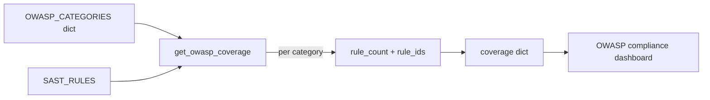

# PRD — Community 612: SAST Engine — OWASP Top 10 Coverage Report

## Master Goal Mapping
**ALDECI Pillar:** SAST compliance reporting — generates a structured coverage summary showing how many SAST rules address each OWASP Top 10 category, enabling security teams to identify rule gaps.

## Architecture Diagram


## Code Proof
**File:** `suite-core/core/sast_engine.py:L2175`  
**Module:** `sast_engine.SASTEngine.get_owasp_coverage`

```python
@staticmethod
def get_owasp_coverage() -> Dict[str, Any]:
    """Return OWASP Top 10 coverage summary."""
    coverage = {}
    for cat, rule_ids in OWASP_CATEGORIES.items():
        coverage[cat] = {
            "rule_count": len(rule_ids),
            "rule_ids": rule_ids,
        }
    return {
        "total_rules": len(SAST_RULES),
        "owasp_categories_covered": len(OWASP_CATEGORIES),
        "categories": coverage,
    }
```

## Inter-Dependencies
- `OWASP_CATEGORIES` — dict mapping OWASP category → rule_ids
- `SAST_RULES` — master rule definitions
- C611 `get_rule_count` — provides `total_rules`
- OWASP compliance report — displays coverage gaps

## Data Flow
`OWASP_CATEGORIES` dict → per-category rule count + IDs → combined with total rule count → structured coverage report.

## Referenced Docs
- ALDECI Rearchitecture v2 §SAST Engine
- OWASP Top 10 2021 (A01–A10)
- NIST SP 800-115 §SAST methodology

## Acceptance Criteria
- [ ] All 10 OWASP categories represented
- [ ] `rule_count` matches `len(rule_ids)` per category
- [ ] `total_rules` equals `get_rule_count()`
- [ ] `owasp_categories_covered` == 10
- [ ] Output is serializable dict

## Effort Estimate
S — 1 day (implemented; add OWASP coverage completeness test)

## Status
DONE — implemented at L2175
