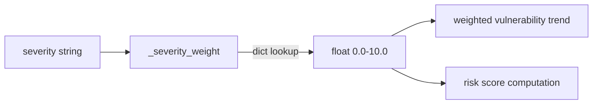

# PRD — Community 613: Vulnerability Analytics — Severity-to-Weight Converter

## Master Goal Mapping
**ALDECI Pillar:** Vulnerability trend analytics — maps severity string labels to numeric weights (0–10 scale) for weighted aggregation in trend charts, heatmaps, and risk scoring calculations.

## Architecture Diagram


## Code Proof
**File:** `suite-core/core/vulnerability_analytics.py:L146`  
**Module:** `vulnerability_analytics.VulnerabilityAnalytics._severity_weight`

```python
@staticmethod
def _severity_weight(severity: str) -> float:
    """Convert severity string to numeric weight (0-10)."""
    return {
        "critical": 10.0, "high": 7.0,
        "medium": 4.0, "low": 1.0, "info": 0.5,
    }.get(severity.lower(), 4.0)
```

## Inter-Dependencies
- `compute_trend()` — uses `_severity_weight` to weight findings per bucket
- `compute_risk_score()` — aggregates weighted findings
- Vulnerability heatmap — color intensity proportional to weight
- C614 `_bucket_format` — sibling helper for trend time axis

## Data Flow
Severity string → lowercase → dict lookup → float weight → used in weighted aggregations and risk scoring.

## Referenced Docs
- ALDECI Rearchitecture v2 §Vulnerability Analytics
- CVSS v3.1 severity bands (critical≥9.0, high≥7.0, medium≥4.0, low<4.0)
- Risk scoring methodology

## Acceptance Criteria
- [ ] `critical` → 10.0, `high` → 7.0, `medium` → 4.0, `low` → 1.0, `info` → 0.5
- [ ] Case-insensitive: `CRITICAL` → 10.0
- [ ] Unknown severity → 4.0 (medium default)
- [ ] Returns `float` (not int)

## Effort Estimate
XS — 0.5 day (implemented; add severity table test)

## Status
DONE — implemented at L146
