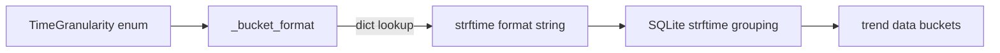

# PRD — Community 614: Vulnerability Analytics — Time Bucket Format String

## Master Goal Mapping
**ALDECI Pillar:** Vulnerability trend analytics — returns the `strftime` format string for daily/weekly/monthly granularity, ensuring consistent time bucket labels across all trend chart queries.

## Architecture Diagram


## Code Proof
**File:** `suite-core/core/vulnerability_analytics.py:L157`  
**Module:** `vulnerability_analytics.VulnerabilityAnalytics._bucket_format`

```python
@staticmethod
def _bucket_format(granularity: TimeGranularity) -> str:
    """Return strftime format string for the requested granularity."""
    return {
        TimeGranularity.DAILY:   "%Y-%m-%d",
        TimeGranularity.WEEKLY:  "%Y-W%W",
        TimeGranularity.MONTHLY: "%Y-%m",
    }[granularity]
```

## Inter-Dependencies
- `compute_trend()` — uses format string in SQLite query
- `TimeGranularity` enum — DAILY / WEEKLY / MONTHLY
- C613 `_severity_weight` — sibling helper in same class
- Vulnerability trend dashboard — renders bucketed chart data

## Data Flow
`TimeGranularity` enum → format string → used in SQL `strftime()` for GROUP BY time bucket → trend data series.

## Referenced Docs
- ALDECI Rearchitecture v2 §Vulnerability Analytics
- SQLite `strftime()` format reference
- ISO 8601 week numbering (`%W`)

## Acceptance Criteria
- [ ] DAILY → `'%Y-%m-%d'`
- [ ] WEEKLY → `'%Y-W%W'`
- [ ] MONTHLY → `'%Y-%m'`
- [ ] Unknown granularity → `KeyError` (strict)
- [ ] Format strings produce valid SQLite strftime output

## Effort Estimate
XS — 0.5 day (implemented; add format string test)

## Status
DONE — implemented at L157
