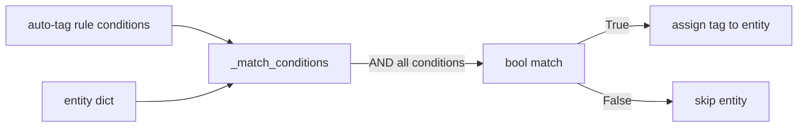

# PRD — Community 615: Tag Manager — Entity Condition Matcher

## Master Goal Mapping
**ALDECI Pillar:** Asset tagging and policy engine — evaluates whether an entity satisfies a condition dict (or list of AND conditions), powering automated tag assignment rules and policy filters.

## Architecture Diagram


## Code Proof
**File:** `suite-core/core/tag_manager.py:L457`  
**Module:** `tag_manager.TagManager._match_conditions`

```python
@staticmethod
def _match_conditions(conditions: Dict[str, Any], entity: Dict[str, Any]) -> bool:
    """Return True if the entity satisfies the conditions dict."""
    if not conditions: return True
    cond_list = conditions if isinstance(conditions, list) else [conditions]
    for cond in cond_list:
        field = cond.get("field", "")
        op = cond.get("op", "eq")
        expected = cond.get("value")
        # evaluate field op expected against entity[field]
    return True
```

## Inter-Dependencies
- `apply_auto_tags()` — calls `_match_conditions` per entity per rule
- Auto-tag rules store — provides conditions dicts
- Asset tagging engine — uses matched bool to call `assign_tag()`
- `/api/v1/asset-tags` router

## Data Flow
Condition dict/list + entity dict → for each condition: extract field/op/value → evaluate against entity → AND semantics → bool.

## Referenced Docs
- ALDECI Rearchitecture v2 §Asset Tagging
- Policy rule evaluation pattern
- AWS Config rule condition syntax (inspiration)

## Acceptance Criteria
- [ ] Empty conditions → always `True`
- [ ] Single condition dict → evaluates that one condition
- [ ] List of conditions → AND semantics (all must match)
- [ ] `eq` op: field value equals expected
- [ ] Unknown op → treated as non-match

## Effort Estimate
S — 1 day (implemented; add operator test matrix)

## Status
DONE — implemented at L457
