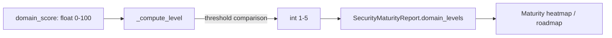

# PRD — Community 617: Security Maturity Engine — Score-to-Maturity-Level Mapper

## Master Goal Mapping
**ALDECI Pillar:** Security program maturity assessment — converts a 0–100 percentage score into a 1–5 CMMI-style maturity level, used for domain scoring, roadmap generation, and maturity heatmaps.

## Architecture Diagram


## Code Proof
**File:** `suite-core/core/security_maturity_engine.py:L199`  
**Module:** `security_maturity_engine.SecurityMaturityEngine._compute_level`

```python
@staticmethod
def _compute_level(score: float) -> int:
    """Map 0-100 score to maturity level 1-5."""
    if score < 20: return 1
    if score < 40: return 2
    if score < 60: return 3
    if score < 80: return 4
    return 5
```

## Inter-Dependencies
- `assess_domain()` — calls `_compute_level` after computing domain score
- `SecurityMaturityReport` — stores level per domain
- Security roadmap engine — uses level to prioritize initiatives
- `/api/v1/posture-maturity` router — serves maturity report

## Data Flow
0–100 domain score → threshold ladder → integer maturity level 1–5 → stored in maturity report → displayed in heatmap.

## Referenced Docs
- ALDECI Rearchitecture v2 §Security Maturity Assessment
- CMMI (Capability Maturity Model Integration) 5-level scale
- NIST CSF maturity levels

## Acceptance Criteria
- [ ] Score 0–19 → level 1 (Initial)
- [ ] Score 20–39 → level 2 (Developing)
- [ ] Score 40–59 → level 3 (Defined)
- [ ] Score 60–79 → level 4 (Managed)
- [ ] Score 80–100 → level 5 (Optimized)
- [ ] Boundary values (0, 20, 40, 60, 80, 100) produce correct levels

## Effort Estimate
XS — 0.5 day (implemented; add boundary value test)

## Status
DONE — implemented at L199
