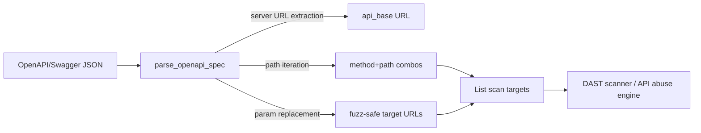

# PRD — Community 618: Real Scanner — OpenAPI Spec to Scan Targets Parser

## Master Goal Mapping
**ALDECI Pillar:** Active security scanning — parses OpenAPI 3.x/Swagger 2.0 specifications to generate type-aware, fuzz-safe scan targets for DAST, API abuse detection, and authentication testing.

## Architecture Diagram


## Code Proof
**File:** `suite-core/core/real_scanner.py:L944`  
**Module:** `real_scanner.RealScanner.parse_openapi_spec`

```python
@staticmethod
def parse_openapi_spec(spec: Dict[str, Any], base_url: str) -> List[Dict[str, Any]]:
    """Parse an OpenAPI/Swagger spec and generate scan targets.
    Supports OpenAPI 3.x (servers) and Swagger 2.0 (basePath).
    Path parameters replaced with fuzz-safe defaults.
    """
    targets = []
    api_base = base_url.rstrip("/")
    if "servers" in spec and spec["servers"]:
        first_server = spec["servers"][0].get("url", "")
        if first_server.startswith("http"): api_base = first_server.rstrip("/")
    # iterate paths, methods, parameters → build target dicts
    return targets
```

## Inter-Dependencies
- `RealScanner.scan_api()` — feeds targets from this method to active scanner
- API abuse detection engine — uses target list for abuse testing
- API security management engine — runs OWASP checks on targets
- C619 `_calculate_entropy` — applied to scanned response bodies

## Data Flow
OpenAPI spec dict + fallback base URL → server URL extraction → path/method iteration → parameter substitution → list of scan target dicts.

## Referenced Docs
- ALDECI Rearchitecture v2 §DAST & API Security
- OpenAPI 3.1 specification (https://spec.openapis.org)
- Swagger 2.0 specification
- OWASP API Security Top 10

## Acceptance Criteria
- [ ] OpenAPI 3.x `servers[0].url` used as base
- [ ] Swagger 2.0 `basePath` used as base
- [ ] Path parameters `{id}` replaced with safe defaults
- [ ] Each target has: `url`, `method`, `path`, `params`, `content_type`
- [ ] Invalid spec does not raise unhandled exception

## Effort Estimate
L — 3 days (implemented; add spec parsing tests for OAS3 + Swagger2 + param types)

## Status
DONE — implemented at L944
