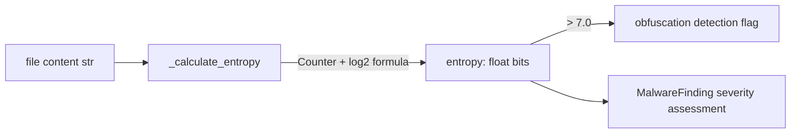

# PRD — Community 619: Malware Detector — Shannon Entropy Calculator

## Master Goal Mapping
**ALDECI Pillar:** Malware analysis — computes Shannon entropy in bits for file content strings, used to detect obfuscated/encrypted malware payloads where high entropy (>7.0 bits) indicates suspicious encoding.

## Architecture Diagram


## Code Proof
**File:** `suite-core/core/malware_detector.py:L318`  
**Module:** `malware_detector.MalwareDetector._calculate_entropy`

```python
@staticmethod
def _calculate_entropy(data: str) -> float:
    """Shannon entropy in bits."""
    if not data: return 0.0
    counts = Counter(data)
    length = len(data)
    return -sum(
        (c / length) * math.log2(c / length)
        for c in counts.values() if c > 0
    )
```

## Inter-Dependencies
- `scan_file()` — calls `_calculate_entropy` on file content
- `_check_behavioral()` — C620, sibling behavioral check
- Obfuscation detector — flags files with entropy > 7.0 bits
- Malware analysis engine — uses entropy as signal in verdict

## Data Flow
File content string → character frequency counting → Shannon formula application → entropy float → compared against threshold.

## Referenced Docs
- ALDECI Rearchitecture v2 §Malware Analysis
- Shannon entropy formula: H = -Σ p(x) log₂ p(x)
- Malware obfuscation detection via entropy analysis

## Acceptance Criteria
- [ ] Empty string → 0.0
- [ ] Single character repeated → 0.0 (no uncertainty)
- [ ] Random/encrypted content → close to 8.0 bits
- [ ] Normal English text → 4.0–5.0 bits
- [ ] Returns `float` in range [0.0, 8.0]

## Effort Estimate
S — 1 day (implemented; add entropy table test)

## Status
DONE — implemented at L318
