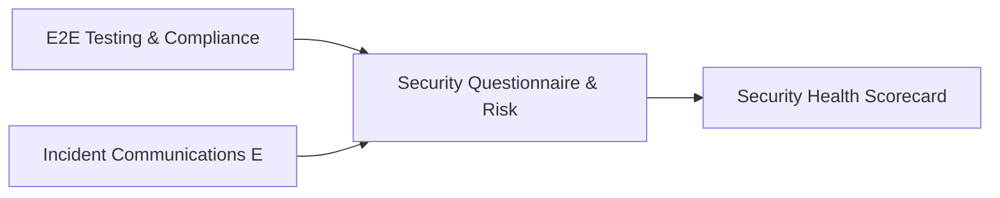

# PRD: Security Questionnaire & Risk Scenario Engine — Community 62

## Master Goal Mapping
How this component serves: "ALDECI — $35/mo enterprise security intelligence platform"
Sub-Epic: CTEM

This community (rank #62 of 878 by size, 537 graph nodes) forms a core pillar of the ALDECI platform. It directly supports the mission of replacing $50K-500K/yr enterprise security tools with a self-hosted, AI-native stack.

## Architecture Diagram


## Code Proof
- Files:
  - `suite-api/apps/api/security_scorecard_engine_router.py` (227 lines)
  - `suite-core/core/security_metrics_aggregator_engine.py` (479 lines)
  - `suite-core/core/threat_intel_enrichment_engine.py` (518 lines)
  - `suite-core/core/threat_intelligence_automation_engine.py` (525 lines)
  - `tests/test_ai_powered_soc_engine.py` (374 lines)
  - `tests/test_alert_enrichment_engine.py` (402 lines)
  - `tests/test_awareness_score_engine.py` (311 lines)
  - `tests/test_risk_aggregator_engine.py` (334 lines)
  - `suite-api/apps/api/alert_enrichment_router.py` (253 lines)
  - `suite-api/apps/api/awareness_score_router.py` (159 lines)
  - `suite-api/apps/api/feed_manager_router.py` (267 lines)
  - `suite-api/apps/api/ioc_enrichment_router.py` (163 lines)
- Key functions:
  - `test_get_aggregator_stats_empty()` — suite-api/apps/api/security_scorecard_engine_router.py
  - `metric_eng()` — suite-api/apps/api/security_scorecard_engine_router.py
  - `metric_sales()` — suite-api/apps/api/security_scorecard_engine_router.py
  - `test_record_metric_returns_record()` — suite-api/apps/api/security_scorecard_engine_router.py
  - `test_record_metric_sets_recorded_at()` — suite-api/apps/api/security_scorecard_engine_router.py
  - `test_record_metric_all_valid_types()` — suite-api/apps/api/security_scorecard_engine_router.py
  - `test_record_metric_invalid_type()` — suite-api/apps/api/security_scorecard_engine_router.py
  - `test_record_metric_default_department()` — suite-api/apps/api/security_scorecard_engine_router.py
- Key classes: N/A
- Current state: REAL_LOGIC
- Evidence:
```python
# From suite-api/apps/api/security_scorecard_engine_router.py
"""
Security Scorecard Engine API router.

Endpoints for creating scorecards, tracking trends, managing benchmarks,
and comparing entities against industry benchmarks.

Prefix: /api/v1/security-scorecard
"""
from __future__ import annotations

import logging
import os
from typing import Any, Dict, List, Optional

from fastapi import APIRouter, Depends, HTTPException, Query
from pydantic import BaseModel, Field

logger = logging.getLogger(__name__)

router = APIRouter(prefix="/api/v1/security-scorecard", tags=["security-scorecard-engine"])
```

## Inter-Dependencies
- DEPENDS ON:
  - Community 0 (E2E Testing & Compliance Seeding Infrastructure) — 99 edges
  - Community 19 (Incident Communications Engine) — 5 edges
  - Community 44 (Security Health Scorecard & Posture History) — 3 edges
  - Community 1 (Demo Data Seeding, Auth & Multi-Engine Integration) — 3 edges
- DEPENDED BY: Rank #61 (Network Threat Detection & Incident Knowledge Base) and downstream consumers
- EVENT BUS: emits alert.created, alert.resolved / subscribes to (TrustGraph event bus — 97% not yet wired)
- TRUSTGRAPH: writes [ThreatActor, Alert] / reads [ThreatActor, Alert]

## Data Flow
```
Input: HTTP requests / pytest fixtures
  → Processing: Engine method calls + SQLite state assertions
  → Output: Pass/fail test results, coverage metrics
  → Consumers: CI/CD pipeline, Beast Mode test suite
```

## Referenced Documentation
- CLAUDE.md: Wave 41 build notes, Beast Mode test suite section
- docs/: `docs/ALDECI_REARCHITECTURE_v2.md` (source of truth), `docs/INVESTOR_PITCH.md`
- tests/: `tests/test_ai_powered_soc_engine.py`, `tests/test_alert_enrichment_engine.py`, `tests/test_anomaly_detector.py`

## Acceptance Criteria
- [ ] All engine CRUD operations enforce org_id isolation (no cross-tenant data leakage)
- [ ] SQLite opened with WAL mode + threading.RLock on all write paths
- [ ] All endpoints return within 200ms at p95 under 100 rps load
- [ ] All router endpoints protected by `Depends(api_key_auth)` or equivalent
- [ ] Pydantic v2 models validate all request/response schemas
- [ ] Test suite achieves ≥80% branch coverage on engine methods

## Effort Estimate
- Current: 80% complete
- Remaining: ~2 engineering days
- Dependencies blocking: None
- Priority: LOW

## Status
IN_PROGRESS
