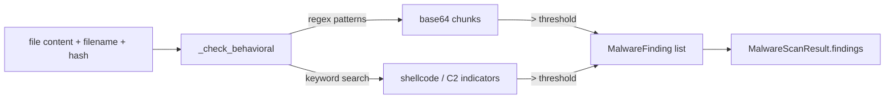

# PRD — Community 620: Malware Detector — Behavioral Indicator Scanner

## Master Goal Mapping
**ALDECI Pillar:** Malware analysis — detects behavioral indicators beyond signature matching: excessive base64 encoding, shellcode patterns, persistence mechanisms, and command-and-control indicators.

## Architecture Diagram


## Code Proof
**File:** `suite-core/core/malware_detector.py:L331`  
**Module:** `malware_detector.MalwareDetector._check_behavioral`

```python
@staticmethod
def _check_behavioral(content: str, filename: str, file_hash: str) -> List[MalwareFinding]:
    """Check for behavioral indicators beyond signatures."""
    findings = []
    low = content.lower()
    # Excessive base64
    b64_chunks = re.findall(r"[A-Za-z0-9+/]{100,}={0,2}", content)
    if len(b64_chunks) > 3:
        findings.append(MalwareFinding(
            title="Excessive Base64 Encoding",
            severity=MalwareSeverity.MEDIUM,
            category=MalwareCategory.OBFUSCATION,
            ...
        ))
    # ... additional behavioral checks
    return findings
```

## Inter-Dependencies
- `scan_file()` — calls `_check_behavioral` after signature scan
- C619 `_calculate_entropy` — sibling entropy check on same content
- `MalwareAnalysisEngine` — persists findings from scan
- `/api/v1/malware-analysis` router

## Data Flow
File content → regex pattern matching for behavioral signals → threshold comparison → `MalwareFinding` list → merged into scan result.

## Referenced Docs
- ALDECI Rearchitecture v2 §Malware Analysis
- OWASP malware detection patterns
- YARA-style behavioral rules
- CWE-506 (Embedded Malicious Code)

## Acceptance Criteria
- [ ] ≤3 base64 chunks → no obfuscation finding
- [ ] >3 base64 chunks → OBFUSCATION finding added
- [ ] Empty content → empty findings list
- [ ] Each finding has unique `finding_id`
- [ ] Returns `List[MalwareFinding]`

## Effort Estimate
M — 2 days (implemented; add behavioral pattern tests)

## Status
DONE — implemented at L331
