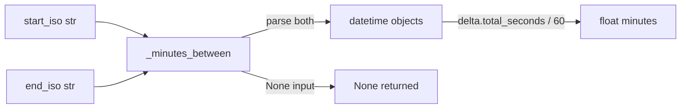

# PRD — Community 623: Incident Timeline Engine — ISO Timestamp Difference in Minutes

## Master Goal Mapping
**ALDECI Pillar:** Incident timeline reconstruction — computes the elapsed minutes between two ISO-8601 UTC timestamps, used for MTTD/MTTR calculation in incident post-mortems and SLA reporting.

## Architecture Diagram


## Code Proof
**File:** `suite-core/core/incident_timeline_engine.py:L149`  
**Module:** `incident_timeline_engine.IncidentTimelineEngine._minutes_between`

```python
@staticmethod
def _minutes_between(start_iso: Optional[str], end_iso: Optional[str]) -> Optional[float]:
    """Return minutes between two ISO timestamps, or None if either is missing."""
    if not start_iso or not end_iso: return None
    try:
        def _parse(s: str) -> datetime:
            for fmt in ("%Y-%m-%dT%H:%M:%S.%f+00:00", "%Y-%m-%dT%H:%M:%S+00:00"):
                try: return datetime.strptime(s, fmt)
                except ValueError: pass
            raise ValueError(f"Cannot parse: {s}")
        delta = _parse(end_iso) - _parse(start_iso)
        return delta.total_seconds() / 60.0
    except (ValueError, TypeError): return None
```

## Inter-Dependencies
- `compute_timeline_metrics()` — calls `_minutes_between` for detect/contain/resolve pairs
- `IncidentTimelineReport` — stores MTTD/MTTC/MTTR in minutes
- SLA compliance engine — compares minutes against SLA thresholds
- `/api/v1/incident-comms` and `/api/v1/sla` routers

## Data Flow
Two ISO strings → parse both with format fallback → timedelta → total_seconds / 60 → minutes float or None.

## Referenced Docs
- ALDECI Rearchitecture v2 §Incident Timeline
- MTTD/MTTC/MTTR metric definitions
- ISO 8601 UTC timestamp formats

## Acceptance Criteria
- [ ] Valid pair → positive float in minutes
- [ ] Either None → returns None
- [ ] Microsecond format parsed
- [ ] Non-microsecond format parsed
- [ ] Unparseable string → None (not exception)

## Effort Estimate
S — 1 day (implemented; add timestamp format variant tests)

## Status
DONE — implemented at L149
