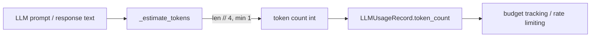

# PRD — Community 624: LLM Monitor — Token Count Estimator

## Master Goal Mapping
**ALDECI Pillar:** LLM usage monitoring — estimates token count from text length using the ~4 chars/token English heuristic, enabling budget tracking and rate limit enforcement without full tokenization.

## Architecture Diagram


## Code Proof
**File:** `suite-core/core/llm_monitor.py:L293`  
**Module:** `llm_monitor.LLMMonitor._estimate_tokens`

```python
@staticmethod
def _estimate_tokens(text: str) -> int:
    """Rough token estimate (~4 chars per token for English)."""
    return max(len(text) // 4, 1)
```

## Inter-Dependencies
- `record_call()` — uses `_estimate_tokens` for prompt and response
- `LLMUsageRecord` — stores estimated tokens
- Budget enforcer — checks cumulative tokens against limit
- AI security advisor — monitors usage via LLMMonitor

## Data Flow
Text string → character length integer division by 4 → max with 1 → estimated token count → stored in usage record.

## Referenced Docs
- ALDECI Rearchitecture v2 §LLM Usage Monitoring
- OpenAI tokenization guidelines (~4 chars/token for English)
- Token budget management

## Acceptance Criteria
- [ ] Empty string → 1 (minimum, not 0)
- [ ] 4-char string → 1 token
- [ ] 400-char string → 100 tokens
- [ ] Returns `int` (not float)
- [ ] No external tokenizer dependency

## Effort Estimate
XS — 0.5 day (implemented; add heuristic test)

## Status
DONE — implemented at L293
