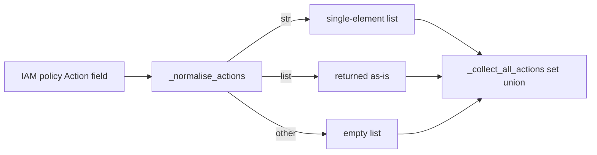

# PRD — Community 625: CIEM Engine — IAM Action Normalizer

## Master Goal Mapping
**ALDECI Pillar:** Cloud Infrastructure Entitlement Management (CIEM) — normalizes AWS IAM policy `Action` field values (string, list, or wildcard) into a flat Python list for consistent privilege analysis.

## Architecture Diagram


## Code Proof
**File:** `suite-core/core/ciem_engine.py:L257`  
**Module:** `ciem_engine.CIEMEngine._normalise_actions`

```python
@staticmethod
def _normalise_actions(actions: Any) -> List[str]:
    """Return a flat list of action strings from an Action field value."""
    if isinstance(actions, str): return [actions]
    if isinstance(actions, list): return actions
    return []
```

## Inter-Dependencies
- `_collect_all_actions()` — calls `_normalise_actions` per statement
- `analyze_policy()` — uses collected actions for privilege check
- C626 `_normalise_resources` — sibling for Resource field
- `/api/v1/iam-policy` router — CIEM analysis endpoint

## Data Flow
IAM policy statement `Action` field → type dispatch → flat list → passed to `_collect_all_actions()` for set union.

## Referenced Docs
- ALDECI Rearchitecture v2 §CIEM Engine
- AWS IAM policy grammar (Action field types)
- CIEM privilege escalation detection methodology

## Acceptance Criteria
- [ ] String `'s3:GetObject'` → `['s3:GetObject']`
- [ ] List `['s3:*', 'ec2:Describe*']` → same list
- [ ] `None` → `[]`
- [ ] Integer → `[]`
- [ ] Wildcard `'*'` → `['*']` (string case)

## Effort Estimate
XS — 0.5 day (implemented; add type-dispatch test matrix)

## Status
DONE — implemented at L257
