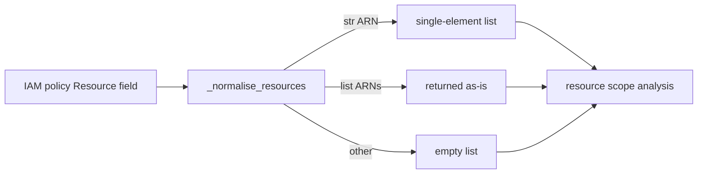

# PRD — Community 626: CIEM Engine — IAM Resource Normalizer

## Master Goal Mapping
**ALDECI Pillar:** CIEM — normalizes AWS IAM policy `Resource` field values (string, list, or wildcard ARNs) into a flat Python list for consistent resource-scope analysis and over-privilege detection.

## Architecture Diagram


## Code Proof
**File:** `suite-core/core/ciem_engine.py:L266`  
**Module:** `ciem_engine.CIEMEngine._normalise_resources`

```python
@staticmethod
def _normalise_resources(resources: Any) -> List[str]:
    """Return a flat list of resource strings from a Resource field value."""
    if isinstance(resources, str): return [resources]
    if isinstance(resources, list): return resources
    return []
```

## Inter-Dependencies
- `_collect_all_actions()` uses resources for statement filtering
- `analyze_policy()` — checks for `Resource: '*'` wildcards
- C625 `_normalise_actions` — sibling for Action field
- Toxic combination detector — uses both actions + resources

## Data Flow
IAM policy `Resource` field → type dispatch → flat ARN list → resource scope check for wildcard `*` over-privilege detection.

## Referenced Docs
- ALDECI Rearchitecture v2 §CIEM Engine
- AWS IAM policy grammar (Resource field types)
- CIEM over-privilege detection: Resource `*` = critical risk

## Acceptance Criteria
- [ ] String ARN → single-element list
- [ ] List of ARNs → returned unchanged
- [ ] Wildcard `'*'` → `['*']`
- [ ] `None` → `[]`
- [ ] Mixed types in list → list returned as-is

## Effort Estimate
XS — 0.5 day (implemented; add type-dispatch test matrix)

## Status
DONE — implemented at L266
