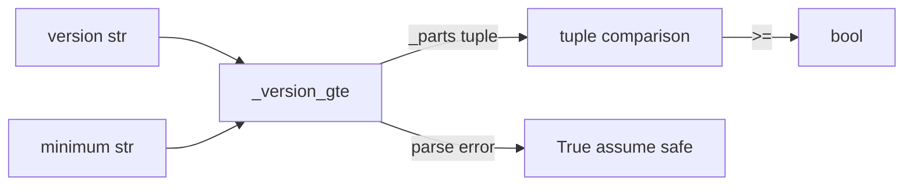

# PRD — Community 627: Postfix Verifier — Semantic Version Comparator

## Master Goal Mapping
**ALDECI Pillar:** Postfix security configuration verifier — compares software version strings using simple semver comparison to validate that dependencies meet minimum security version requirements.

## Architecture Diagram


## Code Proof
**File:** `suite-core/core/postfix_verifier.py:L1494`  
**Module:** `postfix_verifier.PostfixVerifier._version_gte`

```python
@staticmethod
def _version_gte(version: str, minimum: str) -> bool:
    """Return True if version >= minimum (simple semver comparison)."""
    def _parts(v: str) -> Tuple[int, ...]:
        return tuple(int(x) for x in re.split(r"[.\-]", v) if x.isdigit())
    try:
        return _parts(version) >= _parts(minimum)
    except (ValueError, TypeError):
        return True  # Unknown format — assume safe
```

## Inter-Dependencies
- `verify_config()` — calls `_version_gte` for each dependency version check
- `PostfixConfig.dependencies` — provides version strings to check
- Security configuration scanner — uses for version compliance
- `/api/v1/config-benchmark` router — serves config check results

## Data Flow
Version strings → split on `.` and `-` → integer tuple → tuple comparison → bool; parse errors default to True (safe assumption).

## Referenced Docs
- ALDECI Rearchitecture v2 §Configuration Benchmarking
- Semantic versioning specification (semver.org)
- Postfix security hardening guide

## Acceptance Criteria
- [ ] `'3.2.1'` >= `'3.2.0'` → `True`
- [ ] `'3.2.0'` >= `'3.2.1'` → `False`
- [ ] `'3.2.1'` >= `'3.2.1'` → `True`
- [ ] `'3.10.0'` >= `'3.9.0'` → `True` (not lexicographic)
- [ ] Unknown format → `True` (safe assumption)

## Effort Estimate
S — 1 day (implemented; add semver comparison test matrix)

## Status
DONE — implemented at L1494
