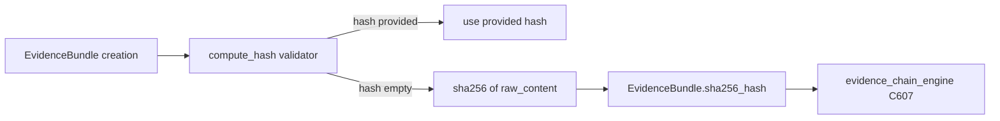

# PRD — Community 628: IR Playbook Engine — SHA-256 Evidence Hash Validator

## Master Goal Mapping
**ALDECI Pillar:** Incident Response playbook engine — computes SHA-256 of evidence `raw_content` at model creation time if no hash is provided, ensuring cryptographic integrity of all playbook evidence bundles.

## Architecture Diagram


## Code Proof
**File:** `suite-core/core/ir_playbook_engine.py:L267`  
**Module:** `ir_playbook_engine.EvidenceBundle.compute_hash`

```python
@field_validator("sha256_hash", mode="before")
@classmethod
def compute_hash(cls, v: str, info: Any) -> str:
    """Compute SHA-256 of raw_content if hash not provided."""
    if v: return v  # Use provided hash
    raw = ""
    if hasattr(info, "data") and "raw_content" in info.data:
        raw = info.data["raw_content"]
    return hashlib.sha256(raw.encode("utf-8")).hexdigest()
```

## Inter-Dependencies
- `EvidenceBundle` Pydantic model — field_validator on `sha256_hash`
- `IRPlaybookEngine.collect_evidence()` — creates EvidenceBundle instances
- Evidence chain engine — C607, stores bundles in WORM chain
- `/api/v1/ir-playbooks` router — IR evidence collection

## Data Flow
Pydantic `field_validator` runs before assignment → if hash empty, compute SHA-256 of `raw_content` → assign to `sha256_hash` field.

## Referenced Docs
- ALDECI Rearchitecture v2 §IR Playbook Engine
- Evidence chain integrity (SHA-256)
- Pydantic v2 field_validator API
- Digital forensics chain of custody

## Acceptance Criteria
- [ ] Provided hash → returned unchanged
- [ ] Empty hash → SHA-256 of `raw_content` computed
- [ ] Empty `raw_content` → SHA-256 of empty string
- [ ] Hash is valid 64-char hex string
- [ ] Pydantic model validates without error

## Effort Estimate
S — 1 day (implemented; add hash computation validation test)

## Status
DONE — implemented at L267
