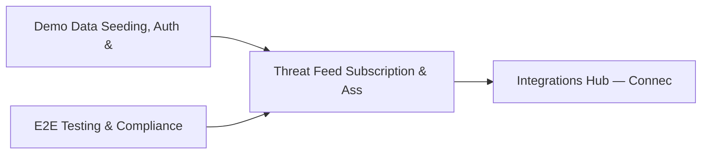

# PRD: Threat Feed Subscription & Asset Group Engine — Community 63

## Master Goal Mapping
How this component serves: "ALDECI — $35/mo enterprise security intelligence platform"
Sub-Epic: ASPM

This community (rank #63 of 878 by size, 522 graph nodes) forms a core pillar of the ALDECI platform. It directly supports the mission of replacing $50K-500K/yr enterprise security tools with a self-hosted, AI-native stack.

## Architecture Diagram


## Code Proof
- Files:
  - `tests/test_incident_metrics_engine.py` (346 lines)
  - `tests/test_vuln_workflow_engine.py` (363 lines)
  - `tests/test_workflow_engine.py` (554 lines)
  - `suite-api/apps/api/connectors_router.py` (385 lines)
  - `suite-api/apps/api/remediation_board_router.py` (250 lines)
  - `suite-api/apps/api/system_router.py` (1066 lines)
  - `suite-api/apps/api/vuln_workflow_router.py` (316 lines)
  - `tests/test_connectors_router_unit.py` (571 lines)
  - `tests/test_connectors_coverage.py` (1133 lines)
  - `tests/test_connectors_router_unit.py` (571 lines)
  - `tests/test_connectors_unit.py` (728 lines)
  - `tests/test_enhanced_decision_unit.py` (305 lines)
- Key functions:
  - `_make_ticket()` — tests/test_incident_metrics_engine.py
  - `board()` — tests/test_incident_metrics_engine.py
  - `org()` — tests/test_incident_metrics_engine.py
  - `sample_card()` — tests/test_incident_metrics_engine.py
- Key classes: `TestTicketCRUD`, `TestSLADueDate`, `TestOverdueDetection`, `TestComments`, `TestAssignment`, `TestBulkOperations`
- Current state: REAL_LOGIC
- Evidence:
```python
# From tests/test_incident_metrics_engine.py
"""Tests for IncidentMetricsEngine — Beast Mode wave 19."""

from __future__ import annotations

import pytest
from core.incident_metrics_engine import IncidentMetricsEngine


@pytest.fixture()
def engine(tmp_path):
    return IncidentMetricsEngine(db_path=str(tmp_path / "inc_metrics.db"))


def _inc(engine, org_id="org1", **kwargs):
    data = {
        "incident_id": f"INC-{id(kwargs)}",
        "title": "Test Incident",
        "severity": "high",
        "category": "malware",
    }
```

## Inter-Dependencies
- DEPENDS ON:
  - Community 1 (Demo Data Seeding, Auth & Multi-Engine Integration) — 93 edges
  - Community 0 (E2E Testing & Compliance Seeding Infrastructure) — 61 edges
  - Community 9 (Integrations Hub — Connectors, Bulk Operations & M) — 39 edges
  - Community 5 (API Bridge, Docs Portal & Cross-Dashboard Infrastr) — 12 edges
- DEPENDED BY: Rank #62 (Security Questionnaire & Risk Scenario Engine) and downstream consumers
- EVENT BUS: emits vulnerability.detected, vulnerability.patched / subscribes to (TrustGraph event bus — 97% not yet wired)
- TRUSTGRAPH: writes [Vulnerability, Incident] / reads [Vulnerability, Incident]

## Data Flow
```
Input: HTTP requests / pytest fixtures
  → Processing: Engine method calls + SQLite state assertions
  → Output: Pass/fail test results, coverage metrics
  → Consumers: CI/CD pipeline, Beast Mode test suite
```

## Referenced Documentation
- CLAUDE.md: Wave 41 build notes, Beast Mode test suite section
- docs/: `docs/ALDECI_REARCHITECTURE_v2.md` (source of truth), `docs/INVESTOR_PITCH.md`
- tests/: `tests/test_connectors_coverage.py`, `tests/test_connectors_router_unit.py`, `tests/test_connectors_unit.py`

## Acceptance Criteria
- [ ] All engine CRUD operations enforce org_id isolation (no cross-tenant data leakage)
- [ ] SQLite opened with WAL mode + threading.RLock on all write paths
- [ ] All endpoints return within 200ms at p95 under 100 rps load
- [ ] All router endpoints protected by `Depends(api_key_auth)` or equivalent
- [ ] Pydantic v2 models validate all request/response schemas
- [ ] Test suite achieves ≥80% branch coverage on engine methods

## Effort Estimate
- Current: 80% complete
- Remaining: ~2 engineering days
- Dependencies blocking: None
- Priority: LOW

## Status
IN_PROGRESS
