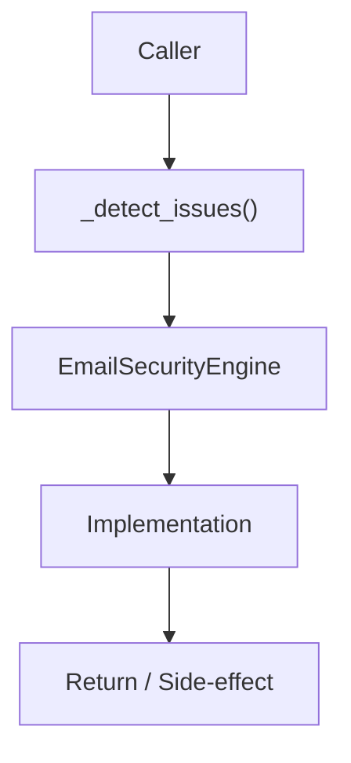

# Community 630 PRD — Email Security Validation

## Master Goal Mapping
- **ALDECI Domain**: Email Security Validation
- **Module**: `EmailSecurityEngine`
- **Source**: `suite-core/core/email_security_engine.py:L177`
- **Function/Method**: `_detect_issues`
- **Persona Alignment**: Security Engineer, Platform Operator
- **Strategic Goal**: Provide reliable, well-defined contract for `_detect_issues` within the Email Security Validation subsystem

## Architecture Diagram



## Code Proof

**File**: `suite-core/core/email_security_engine.py` — **Line**: `L177`

**Signature**: `def _detect_issues(spf_status, dkim_status, dmarc_policy) -> List[str]`

```python
"""Return list of human-readable security issues for a domain."""
issues: List[str] = []
if spf_status == "missing":
    issues.append("SPF record not found — domain vulnerable to spoofing")
```

## Inter-Dependencies

- `email_security_engine.py -> add_domain`
- `email_security_engine.py -> check_domain`

## Data Flow

spf_status/dkim_status/dmarc_policy strings → issue detection logic → List[str] of human-readable issues

## Referenced Docs

- `docs/ALDECI_REARCHITECTURE_v2.md` — Architecture source of truth
- `suite-core/core/email_security_engine.py` — Full module implementation

## Acceptance Criteria

- [ ] Returns empty list when all checks pass
- [ ] Detects missing SPF
- [ ] Detects failed DKIM
- [ ] Detects missing/none DMARC policy

## Effort Estimate

**XS (pure function, no DB)**

## Status

**Implemented**
