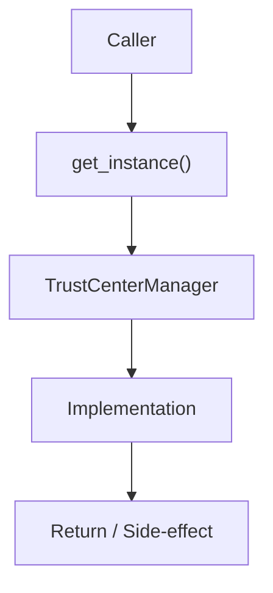

# Community 639 PRD — Trust Center / Singleton Pattern

## Master Goal Mapping
- **ALDECI Domain**: Trust Center / Singleton Pattern
- **Module**: `TrustCenterManager`
- **Source**: `suite-core/core/trust_center.py:L163`
- **Function/Method**: `get_instance`
- **Persona Alignment**: Security Engineer, Platform Operator
- **Strategic Goal**: Provide reliable, well-defined contract for `get_instance` within the Trust Center / Singleton Pattern subsystem

## Architecture Diagram



## Code Proof

**File**: `suite-core/core/trust_center.py` — **Line**: `L163`

**Signature**: `classmethod def get_instance(cls, db_path='...') -> TrustCenterManager`

```python
@classmethod
def get_instance(cls, db_path=":memory:") -> TrustCenterManager:
    """Return the process-wide singleton, creating it if needed."""
    with cls._instance_lock:
        if cls._instance is None:
            cls._instance = cls(db_path)
        return cls._instance
```

## Inter-Dependencies

- `TrustCenterManager.__init__`
- `_instance_lock (threading.Lock)`
- `reset_instance`

## Data Flow

db_path → double-checked lock → TrustCenterManager singleton

## Referenced Docs

- `docs/ALDECI_REARCHITECTURE_v2.md` — Architecture source of truth
- `suite-core/core/trust_center.py` — Full module implementation

## Acceptance Criteria

- [ ] Returns same instance on repeated calls
- [ ] Thread-safe under concurrent access
- [ ] Creates instance with provided db_path on first call
- [ ] Subsequent calls ignore db_path

## Effort Estimate

**XS**

## Status

**Implemented**
