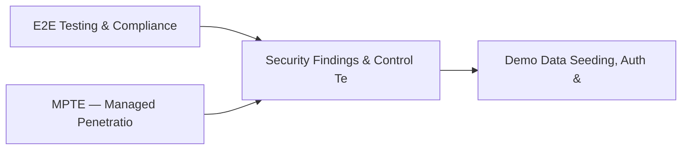

# PRD: Security Findings & Control Testing Engine — Community 64

## Master Goal Mapping
How this component serves: "ALDECI — $35/mo enterprise security intelligence platform"
Sub-Epic: GRC

This community (rank #64 of 878 by size, 506 graph nodes) forms a core pillar of the ALDECI platform. It directly supports the mission of replacing $50K-500K/yr enterprise security tools with a self-hosted, AI-native stack.

## Architecture Diagram


## Code Proof
- Files:
  - `suite-core/core/security_dependency_mapping_engine.py` (486 lines)
  - `suite-core/core/security_registry_engine.py` (507 lines)
  - `tests/test_network_forensics_engine.py` (281 lines)
  - `tests/test_security_dependency_mapping_engine.py` (477 lines)
  - `tests/test_security_registry_engine.py` (441 lines)
  - `suite-api/apps/api/network_forensics_router.py` (141 lines)
  - `suite-api/apps/api/pagerduty_router.py` (291 lines)
  - `suite-api/apps/api/security_dependency_mapping_router.py` (191 lines)
  - `suite-api/apps/api/security_registry_router.py` (224 lines)
  - `suite-core/api/code_to_cloud_router.py` (574 lines)
  - `tests/test_code_cloud_trace.py` (827 lines)
  - `tests/test_code_to_cloud_tracer.py` (304 lines)
- Key functions:
  - `engine()` — suite-core/core/security_dependency_mapping_engine.py
  - `_artifact()` — suite-core/core/security_dependency_mapping_engine.py
  - `_review()` — suite-core/core/security_dependency_mapping_engine.py
  - `test_register_artifact_missing_name_raises()` — suite-core/core/security_dependency_mapping_engine.py
  - `test_register_artifact_empty_name_raises()` — suite-core/core/security_dependency_mapping_engine.py
  - `test_register_artifact_invalid_type_raises()` — suite-core/core/security_dependency_mapping_engine.py
  - `test_register_artifact_all_types()` — suite-core/core/security_dependency_mapping_engine.py
  - `test_register_artifact_default_status_is_draft()` — suite-core/core/security_dependency_mapping_engine.py
- Key classes: N/A
- Current state: REAL_LOGIC
- Evidence:
```python
# From suite-core/core/security_dependency_mapping_engine.py
"""Security Dependency Mapping Engine — ALDECI.

Maps service-to-service dependencies and computes blast radius via BFS traversal
for security impact analysis during incidents and vulnerability management.

Features:
- Service registry with criticality and data classification
- Directed dependency graph with runtime/build/optional types
- BFS blast radius: downstream (who is affected if I go down) / upstream (what do I depend on)
- Critical path identification: most depended-upon critical services
- Summary with high_blast_radius_services (dependent_count >= 5)

Compliance: NIST SP 800-53 SA-9
```

## Inter-Dependencies
- DEPENDS ON:
  - Community 0 (E2E Testing & Compliance Seeding Infrastructure) — 54 edges
  - Community 13 (MPTE — Managed Penetration Test Engine (Advanced)) — 27 edges
  - Community 1 (Demo Data Seeding, Auth & Multi-Engine Integration) — 24 edges
  - Community 5 (API Bridge, Docs Portal & Cross-Dashboard Infrastr) — 17 edges
- DEPENDED BY: Rank #63 (Threat Feed Subscription & Asset Group Engine) and downstream consumers
- EVENT BUS: emits (none currently wired) / subscribes to (TrustGraph event bus — 97% not yet wired)
- TRUSTGRAPH: writes [NetworkAsset, CloudResource] / reads [NetworkAsset, CloudResource]

## Data Flow
```
Input: HTTP requests / pytest fixtures
  → Processing: Engine method calls + SQLite state assertions
  → Output: Pass/fail test results, coverage metrics
  → Consumers: CI/CD pipeline, Beast Mode test suite
```

## Referenced Documentation
- CLAUDE.md: Wave 41 build notes, Beast Mode test suite section
- docs/: `docs/ALDECI_REARCHITECTURE_v2.md` (source of truth), `docs/INVESTOR_PITCH.md`
- tests/: `tests/test_code_cloud_trace.py`, `tests/test_code_to_cloud_tracer.py`, `tests/test_network_forensics_engine.py`

## Acceptance Criteria
- [ ] All engine CRUD operations enforce org_id isolation (no cross-tenant data leakage)
- [ ] SQLite opened with WAL mode + threading.RLock on all write paths
- [ ] All endpoints return within 200ms at p95 under 100 rps load
- [ ] All router endpoints protected by `Depends(api_key_auth)` or equivalent
- [ ] Pydantic v2 models validate all request/response schemas
- [ ] Test suite achieves ≥80% branch coverage on engine methods

## Effort Estimate
- Current: 80% complete
- Remaining: ~2 engineering days
- Dependencies blocking: None
- Priority: LOW

## Status
IN_PROGRESS
