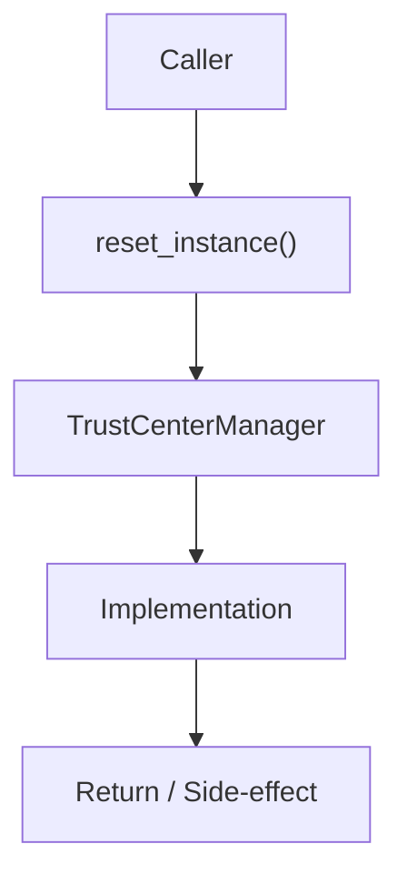

# Community 640 PRD — Trust Center / Test Isolation

## Master Goal Mapping
- **ALDECI Domain**: Trust Center / Test Isolation
- **Module**: `TrustCenterManager`
- **Source**: `suite-core/core/trust_center.py:L171`
- **Function/Method**: `reset_instance`
- **Persona Alignment**: Security Engineer, Platform Operator
- **Strategic Goal**: Provide reliable, well-defined contract for `reset_instance` within the Trust Center / Test Isolation subsystem

## Architecture Diagram



## Code Proof

**File**: `suite-core/core/trust_center.py` — **Line**: `L171`

**Signature**: `classmethod def reset_instance(cls) -> None`

```python
@classmethod
def reset_instance(cls) -> None:
    """Reset singleton (useful for tests)."""
    with cls._instance_lock:
        cls._instance = None
```

## Inter-Dependencies

- `_instance_lock`
- `get_instance`

## Data Flow

lock → set _instance = None → next get_instance call creates fresh instance

## Referenced Docs

- `docs/ALDECI_REARCHITECTURE_v2.md` — Architecture source of truth
- `suite-core/core/trust_center.py` — Full module implementation

## Acceptance Criteria

- [ ] Sets _instance to None under lock
- [ ] Next get_instance creates fresh instance
- [ ] Used in test teardown/setUp

## Effort Estimate

**XS**

## Status

**Implemented**
