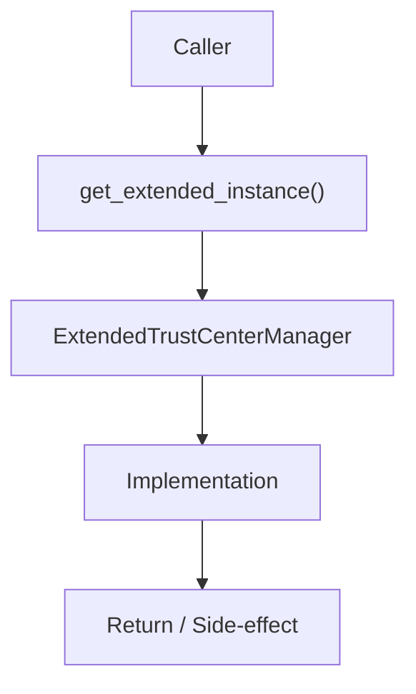

# Community 641 PRD — Extended Trust Center / Singleton

## Master Goal Mapping
- **ALDECI Domain**: Extended Trust Center / Singleton
- **Module**: `ExtendedTrustCenterManager`
- **Source**: `suite-core/core/trust_center.py:L1345`
- **Function/Method**: `get_extended_instance`
- **Persona Alignment**: Security Engineer, Platform Operator
- **Strategic Goal**: Provide reliable, well-defined contract for `get_extended_instance` within the Extended Trust Center / Singleton subsystem

## Architecture Diagram



## Code Proof

**File**: `suite-core/core/trust_center.py` — **Line**: `L1345`

**Signature**: `classmethod def get_extended_instance(cls, db_path='...') -> ExtendedTrustCenterManager`

```python
@classmethod
def get_extended_instance(cls, db_path=":memory:") -> "ExtendedTrustCenterManager":
    """Return the process-wide ExtendedTrustCenterManager singleton."""
    with cls._ext_lock:
        if cls._ext_instance is None:
            cls._ext_instance = cls(db_path)
        return cls._ext_instance
```

## Inter-Dependencies

- `ExtendedTrustCenterManager.__init__`
- `_ext_lock (threading.Lock)`
- `reset_extended_instance`

## Data Flow

db_path → ext_lock → ExtendedTrustCenterManager singleton (separate from base TrustCenterManager)

## Referenced Docs

- `docs/ALDECI_REARCHITECTURE_v2.md` — Architecture source of truth
- `suite-core/core/trust_center.py` — Full module implementation

## Acceptance Criteria

- [ ] Returns same instance on repeated calls
- [ ] Thread-safe under concurrent access
- [ ] Independent of base TrustCenterManager singleton

## Effort Estimate

**XS**

## Status

**Implemented**
